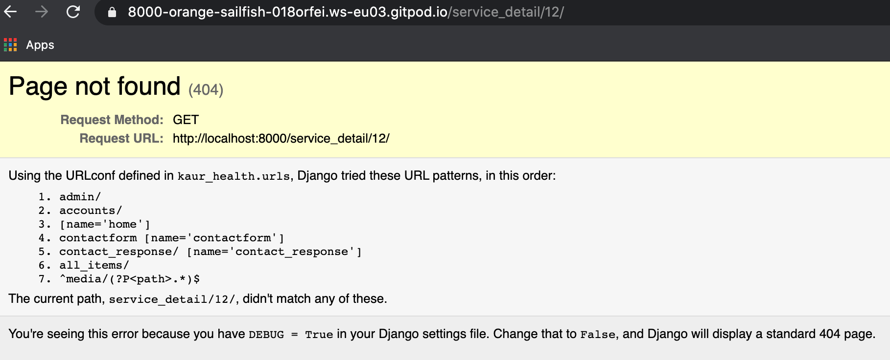

# Kaur Health

[picture]

Link to [Deployed Site]()

Juspreet Kaur is a health coach specialising in the following areas of female health; 

- Health coaching for women to improve general attitude toward food
- Natural Family Planning for couples to conceive  or avoid pregnancy (natural, non-medical contraception)
- DIY cheimcal-free skin care products

[Kaur Health]() is the colation of Juspreets services, which offers the opportunity for potential clients to learn a little more about her and herjourney and how she can potentially hekp them on theirs. 
The site also publishes blog posts about relevant topics, where the site visitors can leave a comment.


This image is created with [ami.responsivedesign]().

## Table of Contents

1. [UX](#ux)
    - [Project Goals](#project-goals)
    - [User Stories](#user-stories)
    - [Design](#design)

2. [Features](#features)
    - [Existing Features](#existing-features)
        - [Landing Page](#landing-page)
        - [Product Page](#product-page)
        - [Cart Page](#cart-page)
        - [Checkout Page](#checkout-page)
        - [Blog Page](#blog-page)
        - [Profiles Page](#profiles-page)
        - [Admin Product Managment](#admin-product-managment)
        - [Django allauth features](#django-allauth-features)
    - [Features Left to Implement](#features-left-to-implement)
    - [Defensive Design](#defensive-design)

3. [Information Architecture](#information-architecture)
    - [Database Choice](#database-choice)
    - [Data Modeling](#data-modeling)

4. [Technologies Used](#technologies-used)
    - [Languages](#languages)
    - [Libraries and Packages](#libraries-and-packages)
    - [Tools](#tools)
    - [Databases](#databases)

5. [Testing](#testing)

6. [Deployment](#deployment)
    - [Heroku Deployment with AWS](#heroku-deployment-with-aws)
    - [Local Deployment](#local-deployment)

7. [Credits](#credits)

8. [Disclaimer](#disclaimer)


# UX
## Project Goals
### Target Audience
- People who are interested in gaining support with; intuitive eating; menstrual health; natural family planning and natural skin care.
- People who want to learn more about any of these topics. 
- People who want to read interesting blog articles about intuitive eating; menstrual health; natural family planning.
- People who seek Juspreets services for a loved one struggling with any of the issues. 
- couples who want to learn how to manage their fertility. 

### Visitor / User Goals
- Purchase services and products in a smooth and secure way
- Get informed on the services/products before buying, with product reviews / product information
- Gain interesting knowledge about iintuitive eating; menstrual health; natural family planning and natural skin care, from blog articles and leave a comment on blog articles
- have login details which provide them with prefilled forms with their information, to save time.

### Business Goals (Site Owner's Goals)
- Provide customers with a secure and safe ecommerce shop
- Establish Kaur health as a credible brand
- Expand Kaur health effectively
- Make profit from selling products / services
- Increasing client retention by providing a login and special benefits as a result

<div><a href="#table-of-contents">Back to top</a></div>

## User Stories

- Viewing and Navigation

| AS A/AN     | I WANT TO BE ABLE TO ... | SO THAT I CAN... |
| ----------- | ----------- | ----------- |
| Site User | Access the website on both larger and smaller screened devices | Access the website on my phone and PC |
| Site User | Easily navigate to the Products and services available | Find the product or service I want to purchase |  
| Site User | Read all content clearly | Enjoy using the site. |
| Site User | See a shopping cart icon on nav bar | Always check the current order and checkout when I want |
| Site User | Be able to easily access information about Juspreet and the services she offers | Trust the validity of her and her services. |


<br/>

- Registration, User Accounts and User Community

| AS A/AN     | I WANT TO BE ABLE TO ... | SO THAT I CAN... |
| ----------- | ----------- | ----------- |
| Site User | Easily register for an account | Have a personal account where I can edit my information and access blog articles |  
| Site User | View my order history | Purchase the same product again in the next order |
| Site User | Easily recover my password in case I forget it | Recover access to my account |
| Site User | Receive an email confirmation after registering | Verify that my account registration was successful |
| Site User | Post a blog about any of my areas of expertise | Provide site visitors interesting information and hopefully make a sale as a result |
| Site User | Add comments to the blog posts | Write down my thoughts on the post |
| Site User | Have the ability to remove unsavoury comments | Protect my brand and the site visitors' experince |
<br/>

- Online shopping

| AS A/AN     | I WANT TO BE ABLE TO ... | SO THAT I CAN... |
| ----------- | ----------- | ----------- |
| Site User | View individual product pages that have prices and descriptions | Get detailed information about the product before purchasing |
| Site User| Filter by a specific category | Easily find products in a specific category |
| Site User | Leave/View product reviews with scores | Understand which products are popular with other customers |
| Site User | Easily add a new product | Make sure the online site has the latest catalogue |
| Site User | Easily remove a product | Make sure the online site has the latest catalogue |

<br/>

- Cart, Purchasing and Checkout

| AS A/AN     | I WANT TO BE ABLE TO ... | SO THAT I CAN... |
| ----------- | ----------- | ----------- |
| Site User | Easily select the quantity (if applicable) of a product after adding a product to a cart | Ensure I don't accidentally select the wrong product and the quantity | 
| Site User | Have my delivery information is prefilled if logged in | Smoothly proceed with my purchase | 
| Site User | Be reminded to log in if I did not log in | Smoothly proceed with my purchase and prefilled form | 


<br/>

<div><a href="#table-of-contents">Back to top</a></div>

## Design
### Wireframes
Wireframes were created with [balsamiq](https://balsamiq.com/) 

You can find the wireframes [here]()

### Brand Identity
- Vision: Aesthetically pleasing, none pretentious site, empowering people who are in search of Kaur Health's services or curious about them.  
- Mission: Provide clients with support on intuitive eating, menstruation, skincare and natural family planning, not jus in the UK, but worldwide. Use the site as a mechanism to bring conversations on these topics to the forefront of society and eventually use the site to host virtual consultations, webinars etc. Doing everything possoible, to minimise the distance between the user/ client and saccess to this valuable information. 
- Values: 1. Female Health - Improving a womans understanding of her bodyily functions and how they relate to her fertility, menstrual cycle, physical appearance and ultimately mental health. 2. 

### Color Scheme
Color scheme is important as this is one of the first things site visitors notice when visiting the site. I chose persian indigo and avacado for the site's primary colors because these colors are bold and strong, not typically 'female' but statistically, very inticing for women . In addition to that, for the secondary colors of the site, I wanted to create a balance of bold to calm, whilst providing continuity in the colours too . For the secondary colour i chose medium slate blue. I used [Coolors.co](https://coolors.co/) to create a color pallet, which you can find below.

[This article](https://neilpatel.com/blog/psychology-of-color-and-conversions/) explained the importance of recognising the effect of colurs on your audiences mood. the article explains that "35% of women said blue was their favorite color, followed by purple (23%) and green (14%). 33% of women confessed that orange was their least favorite color, followed by brown (33%) and gray (17%)." as the content of this site will appeal mainly to women, i decided i needed colours that would be most inviting to them. 

[This pallet] ()
totally enages and appeals to women, whilst not being sterotypically 'girly and therefore offputtting to men! 

### Typography
To reflect the kaur Helath's brand identity, the typeface chosen for main headings was Mulish, (formerly known as Muli) and I coupled this with Nunito for the body text, both of these fonts fall under the sans serif family. I chose this duo, after doing some research and realising that I needed the font to reflect; strength; empowerment; practicality and most importantly readability. Due to the nature of the sites content, being quite woman centric, i was tempted to select a playful font, such as Oleo script, however i decided this woud take away from the profesional feel i was aiming to achieve. [This article]("https://piktochart.com/blog/fonts-and-colors/#:~:text=For%20subheadings%20and%20body%20text,partially%20for%20titles%20or%20headlines") by Natasya Sunarto was very insightful, as it compared a range of industries and i was able to work out where Kaur Health fits within the examples and make an informed decision about which typeface would be most fitting. 

- Icon: [kaur Health]() is used for the main icon library accross the site.
- Favicon: I got the favicon by [Freepik](https://www.flaticon.com/authors/freepik) from [www.flaticon.com](https://www.flaticon.com/).

### Brand Logo
Logo design is the cornerstone in your brand identity and presents a company's name, product and brand. I consulted with Juspreet to capture a balance of vision mission and culture, used []( to create the brand logo file. The font represents the brand value `x` and the image of x was added to represent `x` brand value.


<div "text-align: right;"><a href="#table-of-contents">Back to top</a></div>

# Features

## Existing Features
This website is composed of 6 applications: `home`, `blog`, `cart`, `checkout`, `products`, `services`, `profiles`.

## Landing Page
Landing Page is designed as a single page website to provide site visitors with enough information so they can understand what the business is about of this site. This page has minimal content; merely an explanation of who juspreet is and the brand kaur health. This is to let the site visitors take next actions. The page compose of `Navbar`, `Carousel`, `About`, `x`, `testimonials` and `Contact Form` section. 

### Navbar
Navbar is fixed at the top of pages across the site, so that the site visitors easily navigate the whole site.  Navbar contains  `Brand Logo`, `Search Box`, `Site Menu`, `My Account dropdown` and `Cart icon`.
- Search box: This search box function allows the visitors to search the products on online shop with keywords. The keywords are searched over `name` and `description` field of Product Model, `name` and `description` field of Service Model.(Details of these models will be described at the [Information Architecture](#information-architecture)) This function uses "" condition not "" when searching the keywords, meaning, if the search query was "", the search result shows the product found using the keyword . Searching with "" condition is chosen in order 
- Site Menu & My Account dropdown: The site menu collapses to toggle icon less than 992px width. My Account dropdown is included to toggle menu for smaller screen.
- Cart icon: The number next to the cart icon shows the total of items added to the cart.


Navbar for larger screensizes (width > 992px)
<div align="center"></div>

Navbar for smaller screensizes (width < 992px)
<div align="center"></div>

Navbar for authenticated users
<div align="center"></div>


### About me
`About me` section explains who Juspreet is to the site visitor.
<div align="center"></div>

`Kaur Health` section showcases three sales points of the shop with icons representing each one.
Those two sections use the color of `` and `` from the color pallete for its background color that seamlessly matches the next section's background.
<div align="center"></div>

### Testimonial
A customer testimonial section can contribute to building the trust of potential customers and also explain the benefits of your products or services. This section displays different customer's testimonials with smooth carousel auto-animation effects.
<div align="center"></div>

### Contact Form
A simple contact form is placed at the end of the landing page. The email address field is prefilled if the users are logged into their account. Site visitors will fill out fields `name`, `email`, `subject` and `message` when they submit the form. An email with the inquiry from the form will be sent to the admin of the website (handling by django send_mail() functionality).
<div align="center"></div>

### Footer
The footer section is just links to Social Media with their icons. In this milestone project, Social Media icons are linked to Juspreets personal social media accounts, as her brand is consistent on her social media.
<div align="center"></div>

<div><a href="#table-of-contents">Back to top</a></div>

## Product Page
### Online Shop Page
By clicking 'products/services' on the site menu, you can go to the online shop page. This page is filtered with 'natural family planning' category as a default as the shop owner wants to promote products that fall under natural family planning category that has higher profit. However, the site visitor can adjust the filter condition very easily.  
- Product Filter: There is a filter section at the left side of the online shop page, and you can filter products with `categories`. You can also select multiple choices within the same filter option and use several filters to get the results.(e.g. you can choose skincare and intuitive eating. In this case, the result will show the products that fall under () AND ().) I designed the filter this way in order not to narrow down the products the potential customers are looking for.
<div align="center"></div>

- Result Number: It's shown above the product cards. Customers can see how many results were found in total at a glance.
<div align="center"></div>

- Product Card: The products are displayed in cards that have `Product/ Service Name`, `Price`, `Unit`, and `View Details` button when hovering ove the product image. `Add to Cart` button addes the product with 1 quantity to the cart and this button only appears for products, because the services are monthly subscription/ phonecalls. If the user is logged in as a superuser, Edit / Delete option is also shown on each card.

Product Card for products
<div align="center"></div>

Product Card for services
<div align="center"></div>

- Pagination Bar: unnecessary here..


### Product Detail Page

<div align="center"></div>


## Cart Page

<div align="center"></div>

## Checkout Page
### Checkout Page


### Checkout Success Page


<div><a href="#table-of-contents">Back to top</a></div>

## Blog Page
### Blog Feed Page


### Blog Post Detail Page


<div align="center"></div>

### Add/Edit Blog
- 

## Profiles Page

### My Profile Page


## Admin Product Managment

## Django-allauth features
Base template for allauth has `Back to Home` button at the end of the page, for easy navigation for users.
- Sign Up: The users will be asked to fill out `E-mail`, `User Name` and `Password` to create an account. When the sign up form is submitted, a verification email will be sent to the user's email address to complete the sign up process.
- Log In: Users will be asked to input `User Name` or `Email`, and `Password` to login. If the user successfully logged in, a success message will pop up and redirect to the landing page.
- Log out: Log out page is accessible from the site menu. After the user successfully signed out button on the sign out page, a success message will appear and redirect to the landing page.
- Forgot password: Forgot password page is accessible from Sign In page. Users will be asked to put in an email address which they have used for their registration to the site. An email with a link to reset the password will be sent after submitting the form.

<div><a href="#table-of-contents">Back to top</a></div>

## Features Left to Implement


## Defensive Design
### Error views (404 and 500 error)


### Form Validation
- Django Form Validation

### Product Quantity Counter Validation


<div><a href="#table-of-contents">Back to top</a></div>

# Information Architecture
## Database choice
- Development phase
**SQLight** database was used for the development which is installed with Django. 

- Deployment phase
**PostgreSQL** was used on deployment stage, which is provided as add-on by Heroku application.

- User model is provided as a default by [Django's authentication system](https://docs.djangoproject.com/en/3.1/ref/contrib/auth/).

## Data Modeling
Following is Entity Relationship Diagram of this project. I created this diagram with [dbdiagram.io](https://dbdiagram.io/home).
When I designed this ERD, I referred to [this article](https://launchschool.com/books/sql/read/table_relationships). 
<p align="center"></p>

# Bugs discovered

Service details not showing up 
Solution: Correct the URLs for the app
- I have three models categories, services and products. Products and services, rely on the categories model. 
- When i built the template for the product and service details, the product detail worked fine, but the service details would not. 
- if i clicked on a service, i would be taken to the details of a product with the same pk as the service i had clicked on. 
- I thought it was an issue with the primary keys, but i couldnt work out what the issue was, because the primary keys were from different models. 
- In an attempt to rule this out, I displayed the ids (primary keys) of each service using 
``` {{ service.id }} ```
- Then i changed the pk of one of my services to a number that was entirely different to any of the pk values of the products or services. 
- when i clicked on this service, i got an error.

- This told me, the service details were reliant on the product id's. The new pk of the service i had tried to access, was out of range of the current product ids.
- this led me to check the link path of the items when they were clicked. this revealed all items were following the ``` all_items/<pk_value> ``` path. 
- this in turn led me to change my products and services app urls from 
``` path('<int:product_id>/', ```
```        views.product_detail, name='product_detail'), ```
``` path('<int:service_id>/', ```
```        views.service_detail, name='service_detail'), ```
 to 
``` path('product_detail/<int:product_id>/', ```
```        views.product_detail, name='product_detail'), ```
``` path('service_detail/<int:service_id>/', ```
```        views.service_detail, name='service_detail'), ```
- this solved the issue
### Product App


### Order App

### Blog App

### Profile App

<div><a href="#table-of-contents">Back to top</a></div>

# Technologies Used
The main frontend development was created using HTML, CSS, JavaScript and their libraries. The main backend development was powered by Python and Django.

## Languages
- HTML, CSS, JavaScript, Python

## Libraries and Packages
- [Django](https://www.djangoproject.com/)
- [Django Crispy Forms](https://django-crispy-forms.readthedocs.io/en/latest/)
- [Django Allauth](https://django-allauth.readthedocs.io/en/latest/installation.html)
- [Bootstrap (v4.4.1)](https://www.bootstrapcdn.com/)
- [JQuery](https://jquery.com/)
- [JQuery-UI](https://jqueryui.com/)
- [Popper.js](https://popper.js.org/)
- [Font Awesome](https://fontawesome.com/)
- [Animate.css](https://animate.style/)
- [Wow.js](https://www.delac.io/wow/)
- [Stripe](https://stripe.com/ie)
- [Google Fonts](https://fonts.google.com/)

## Tools
- Git/GitHub
- Gitpod
- [PIP](https://pip.pypa.io/en/stable/installing/)
- [Django Debug Toolbar](https://django-debug-toolbar.readthedocs.io/en/latest/)
- [dbdiagram.io](https://dbdiagram.io/home)
- [AWS S3 bucket](https://aws.amazon.com/)

## Databases
- [SQlite3](https://www.sqlite.org/index.html)- database used for development.
- [PostgreSQL](https://www.postgresql.org/) - database used for production.

# Testing
Testing was conducted and recorded in a different file: [Testing.md]().

<div><a href="#table-of-contents">Back to top</a></div>

# Deployment
## Heroku Deployment with AWS
This website is deployed on [Heroku](https://www.heroku.com/), following these steps:
1. Install these packages to your local environment, since these packages are required to deploy a Django project on Heroku.
- [gnicorn](https://gunicorn.org/): `gnicorn` is Python WSGI(web server gataway interface) server for UNIX.
- [gninx](https://www.nginx.com/): `gninx` is a free, open-source, high-performance HTTP server and reverse proxy, as well as an IMAP/POP3 proxy server.
- [psycopg2-binary](https://pypi.org/project/psycopg2-binary/): `psycopg2-binary` is PostgreSQL database adapter for the Python programming language.
- [dj-database-url](https://pypi.org/project/dj-database-url/): `dj-database-url` allows you to utilize the 12factor inspired DATABASE_URL environment variable to configure your Django application.
2. Create a `requirements.txt` file and freeze all the modules with the command `pip3 freeze > requirements.txt` in the terminal.
3. Create a `Procfile` write `web: gunicorn boutique_ado.wsgi:application` in the file.
4. `git add` and `git commit` and `git push` all the changes to the Github repositoty of this project.
5. Go to Heroku and create a **new app**. Set a name for this app and select the closest region (Europe) and click **Create app**.
6. Go to **Resources** tab in Heroku, then in the **Add-ons** search bar look for **Heorku Postgres**(you can type postgres), select **Hobby Dev — Free** and click **Submit Order Form** button to add it to your project.
7. In the heroku dashboard for the application, click on **Setting** > **Reveal Config Vars** and set the values as follows:

| Key | Value |
| ----------- | ----------- |
| AWS_ACCESS_KEY_ID | `Your AWS Access Key` |
| AWS_SECRET_ACCESS_KEY | `Your AWS Secret Access Key` |
| DATABASE_URL | `Your Postgres Database URL` |
| EMAIL_HOST_PASS | `Your Email Password (generated by Gmail)` |
| EMAIL_HOST_USER | `Your Email Address` |
| SECRET_KEY | `Your Secret Key` |
| STRIPE_PUBLIC_KEY | `Your Stripe Public Key` |
| STRIPE_SECRET_KEY | `Your Stripe Secret Key` | 
| STRIPE_WH_SECRET | `Your Stripe WH Key` |
| USE_AWS | `True` |

* I used []()to generate Django Secret Key.

8. Comment out the current database setting in settings.py, and add the code below instead. This is done temporarily to migrate the datbase on Heroku.
```
  DATABASES = {     
        'default': dj_database_url.parse("<your Postrgres database URL here>")     
    }
```
9. Migrate the database models to the Postgres database using the following commands in the terminal:
`python3 manage.py migrate`
10. Load the data fixtures(color_table, flower_table, image_table, product_table) into the Postgres database using the following command:
`python3 manage.py loaddata <fixture_name>`
11. Create a superuser for the Postgres database by running the following command:
`python3 manage.py createsuperuser`
12. Replace the database setting with the code below, so that the right database is used depending on development/deployed environment.
```
if 'DATABASE_URL' in os.environ:
    DATABASES = {
        'default': dj_database_url.parse(os.environ.get('DATABASE_URL'))
    }
else:
    DATABASES = {
        'default': {
            'ENGINE': 'django.db.backends.sqlite3',
            'NAME': os.path.join(BASE_DIR, 'db.sqlite3'),
        }
    }
```
13. Disable collect static, so that Heroku won't try to collect static file with: `heroku config:set DISABLE_COLLECTSTATIC=1`
14. Add `'flowerydays.herokuapp.com', 'localhost', '127.0.0.1'` to `ALLOWED_HOSTS` in settings.py.
```
ALLOWED_HOSTS = ['flowerydays.herokuapp.com', 'localhost', '127.0.0.1']
```
15. In Stripe, add Heroku app URL a new webhook endpoint.
16. Update the settings.py with the new Stripe environment variables and email settings.
17. Commit all the changes to Heroku. Medial files are not connected to the app yet but the app should be working on Heroku.

### Amazon Web Service S3
The static files and media files for this deployed site (e.g. image files for product/blog) are hosted in the [AWS](https://aws.amazon.com/) S3 Bucket. You will need to create S3 bucket, complete the setting up and upload static files and media files to the S3 bucket. You can find [Amazon S3 documentation](https://docs.aws.amazon.com/AmazonS3/latest/gsg/CreatingABucket.html) for more information on the setting.
I used CORS configuration below:
```
[
  {
      "AllowedHeaders": [
          "Authorization"
      ],
      "AllowedMethods": [
          "GET"
      ],
      "AllowedOrigins": [
          "*"
      ],
      "ExposeHeaders": []
  }
]
```

- Setting for static/media files in settings.py
1. Install `boto3` and `django-storages` with a command `pip3 install boto3` and `pip3 install django-storages` in your terminal, to connect AWS S3 bucket to Django.
2. Add 'storages' to `INSTALLED_APPS` in settings.py.
3. Add the following in settings.py.
```
if 'USE_AWS' in os.environ:
    # Cache Control
    AWS_S3_OBJECT_PARAMETERS = {
        'Expires': 'Thu, 31 Dec 2099 20:00:00 GMT',
        'CacheControl': 'max-age=94608000',
    }

    # Bucket Config
    AWS_STORAGE_BUCKET_NAME = 'flowerydays'
    AWS_S3_REGION_NAME = 'eu-west-1'
    AWS_ACCESS_KEY_ID = os.getenv('AWS_ACCESS_KEY_ID')
    AWS_SECRET_ACCESS_KEY = os.getenv('AWS_SECRET_ACCESS_KEY')
    AWS_S3_CUSTOM_DOMAIN = f'{AWS_STORAGE_BUCKET_NAME}.s3-eu-west-1.amazonaws.com'

    # Static and media files
    STATICFILES_STORAGE = 'custom_storages.StaticStorage'
    STATICFILES_LOCATION = 'static'
    DEFAULT_FILE_STORAGE = 'custom_storages.MediaStorage'
    MEDIAFILES_LOCATION = 'media'

    # Override static and media URLs in production
    STATIC_URL = f'https://{AWS_S3_CUSTOM_DOMAIN}/{STATICFILES_LOCATION}/'
    MEDIA_URL = f'https://{AWS_S3_CUSTOM_DOMAIN}/{MEDIAFILES_LOCATION}/'
```
5. Add [custom_storages.py](https://github.com/AsunaMasuda/FloweryDays/blob/master/custom_storages.py).
6. Delete DISABLE_COLLECTSTATIC from Heroku Config Var.
7. Push all the changes to Github/Heroku and all the static files will be uploaded to S3 bucket.
By setting up above, Heroku will run python3 manage.py collectstatic during the build process and look for static and media files.

### Automatic Deploy on Heroku
You can enable automatic deploy in the following steps that pushes update to Heroku everytime you push to github.
1. Go to Deploy in Heroku dashboard.
2. At `Automatic deploys`, choose a github repository you want to deploy.
3. Click `Enable Automatic Deploys`.


## Local Deployment
For local deployment, you need to have an IDE (I used Gitpod for this project) and you need to install the following:
- Git, Python3, PIP3
Also, you need to create account in the following services if you don't own yet:
- Stripe, AWS (S3 bucket), Gmail

1. In the IDE you are using, copy and paste the following commane into the terminal to clone this repository.
    `git clone `
(the other ways to clone a repository are written in this [GitHub documentation](https://docs.github.com/en/free-pro-team@latest/github/creating-cloning-and-archiving-repositories/cloning-a-repository))
2. Set up environment variable in your selected IDE, or you can create `.env` file in your root directory and add `.env` to `.gitignore` file, and add the followings to the `.env` file.
```
import os  
os.environ["DEVELOPMENT"] = "True"    
os.environ["SECRET_KEY"] = "<Your Secret Key>"
os.environ["STRIPE_PUBLIC_KEY"] = "<Your Stripe Public Key>"    
os.environ["STRIPE_SECRET_KEY"] = "<Your Stripe Secret Key>"    
os.environ["STRIPE_WH_SECRET"] = "<Your Stripe WH Secret Key>"    
```
3. Install all the required packages with `pip3 install -r requirements.txt`
4. Migrate the models to crete a database using in your IDE with `python3 manage.py makemigrations` and `python3 manage.py migrate`
5. Load the data fixtures(color_table, flower_table, image_table, product_table) into the database using the following command:
`python3 manage.py loaddata <fixture_name>`
6. Create a superuser for the Postgres database by running with `python3 manage.py createsuperuser`
7. Now you can access the app using the command `python3 manage.py runserver`

<div><a href="#table-of-contents">Back to top</a></div>

# Credits

### Content & Code
-
- I was inspired by the flow and structure of flowery days project by []() and used her read me as a template. 
- This project was developed refering to the Boutique Ado Django mini-project from Code Institute course materials. The codes are customized and modified to fit the purpose of this milestone project.

### Images & Media
- https://www.healthline.com/health/magnesium-oil-benefits
- medlife.com/blog/5-natural-ways-relieve-menstrual-cramps/#:~:text=2.-,Fennel,honey%20and%20mix%20it%20well.
- template tags : https://engineertodeveloper.com/a-better-way-to-route-back-to-a-section-ids-in-django/

### Acknowledgements
- Thanks to: my Code Institute Mentor  advice throughout the development process.
- Code Institute Slack Community that gave me a light when I was stuck in my coding.

### Disclaimer
This website is created for educational purpose only. content entirely fictional. 