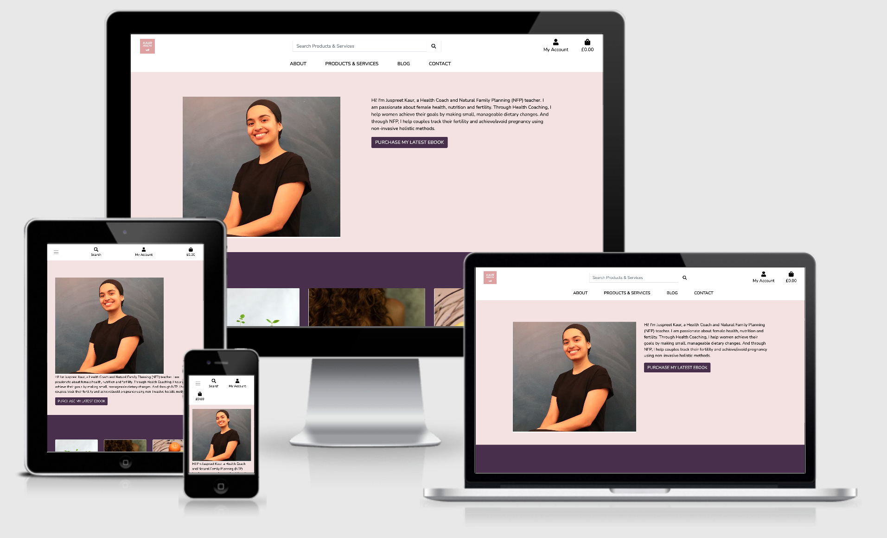

# Kaur Health



This image is created with [ami.responsivedesign](http://ami.responsivedesign.is/?url=https%3A%2F%2Fkaur-health.herokuapp.com%2F).

Link to [Deployed Site](https://kaur-health.herokuapp.com/)

Juspreet Kaur is a health coach specialising in the following areas of female health; 

- Health coaching for women to improve general attitude toward food
- Natural Family Planning for couples to conceive  or avoid pregnancy (natural, non-medical contraception)
- DIY chemical-free skincare products

[Kaur Health](https://kaur-health.herokuapp.com) is the collation of Juspreets services, which offers the opportunity for potential clients to learn a little more about her, her professional journey and most importantly; how she can help clients achieve their goals. 
The site also publishes blog posts about relevant topics, where the site visitors can leave a comment.


## Table of Contents

1. [UX](#ux)
    - [Project Goals](#project-goals)
    - [User Stories](#user-stories)
    - [Personas](#personas)
    - [Design](#ux-design-process) 

2. [Features](#features)
    - [Existing Features](#existing-features)
        - [Landing Page](#landing-page)
        - [Product Page](#Product-and-services-App)
        - [Admin Product Managment](#admin-product-managment)
        - [Bag Page](#bag-app)
        - [Checkout Page](#checkout-app)
        - [Profiles Page](#profile-app)
        - [Blog Page](#blog-app)
        - [Contact Page](#contact-page)
        - [Django allauth features](#django-allauth-features)
    - [Features Left to Implement](#features-left-to-implement)
    - [Defensive Design](#defensive-design)

3. [Information Architecture](#information-architecture)
    - [Database Choice](#database-choice)
    - [Data Modeling](#data-modeling)

4. [Technologies Used](#technologies-used)
    - [Languages](#languages)
    - [Libraries and Packages](#libraries-and-packages)
    - [Tools](#tools)
    - [Databases](#databases)

5. [Testing](#testing)

6. [Deployment](#deployment)
    - [Heroku Deployment with AWS](#heroku-deployment-with-aws)
    - [Local Deployment](#local-deployment)

7. [Credits](#credits)

8. [Disclaimer](#disclaimer)

9.[Reflection](#reflection)


# UX
## Project Goals
### Target Audience
- People who are interested in gaining support with; intuitive eating; menstrual health; natural family planning and natural skincare.
- People who want to learn more about any of these topics. 
- People who want to read interesting blog articles about intuitive eating; menstrual health; natural family planning.
- People who seek Juspreets services for a loved one struggling with any of the issues. 
- couples who want to learn how to manage their fertility. 

### Visitor / User Goals
- Purchase services and products in a smooth and secure way
- Get informed on the services/products before buying, with product reviews/product information
- Gain interesting knowledge about intuitive eating; menstrual health; natural family planning and natural skincare, from blog articles and leave a comment on blog articles
- have login details that provide them with prefilled forms with their information, to save time.

### Business Goals (Site Owner's Goals)
- Provide customers with a secure and safe e-commerce shop
- Establish Kaur health as a credible brand
- Expand Kaur health effectively
- Make profit from selling products/services
- Increasing client retention by providing a login and special benefits as a result

<div><a href="#table-of-contents">Back to top</a></div>

## User Stories

- Viewing and Navigation

| AS A/AN     | I WANT TO BE ABLE TO ... | SO THAT I CAN... |
| ----------- | ----------- | ----------- |
| Site User | Access the website on both larger and smaller screened devices | Access the website on my phone and PC |
| Site User | Easily navigate to the Products and services available | Find the product or service I want to purchase |  
| Site User | Read all content clearly | Enjoy using the site. |
| Site User | See a shopping cart icon on navbar | Always check the current order and checkout when I want |
| Site User | Be able to easily access information about Juspreet and the services she offers | Trust the validity of her and her services. |


<br/>

- Registration, User Accounts and User Community

| AS A/AN     | I WANT TO BE ABLE TO ... | SO THAT I CAN... |
| ----------- | ----------- | ----------- |
| Site User | Easily register for an account | Have a personal account where I can edit my information and access blog articles |  
| Site User | View my order history | Purchase the same product again in the next order |
| Site User | Easily recover my password in case I forget it | Recover access to my account |
| Site User | Receive an email confirmation after registering | Verify that my account registration was successful |
| Site User | Post a blog about any of my areas of expertise | Provide site visitors interesting information and hopefully make a sale as a result |
| Site User | Add comments to the blog posts | Write down my thoughts on the post |
| Site User | Remove unsavoury comments | Protect my brand and the site visitors' experience |
<br/>

- Online shopping

| AS A/AN     | I WANT TO BE ABLE TO ... | SO THAT I CAN... |
| ----------- | ----------- | ----------- |
| Site User | View individual product pages that have prices and descriptions | Get detailed information about the product before purchasing |
| Site User| Filter by a specific category | Easily find products in a specific category |
| Site User | Leave/View product reviews with scores | Understand which products are popular with other customers |
| Site User | Easily add a new product | Make sure the online site has the latest catalogue |
| Site User | Easily update and remove a product | Make sure the online site has the latest catalogue |

<br/>

- Cart, Purchasing and Checkout

| AS A/AN     | I WANT TO BE ABLE TO ... | SO THAT I CAN... |
| ----------- | ----------- | ----------- |
| Site User | Easily select the quantity (if applicable) of a product after adding a product to a cart | Ensure I don't accidentally select the wrong product and the quantity | 
| Site User | Have my delivery information is prefilled if logged in | Smoothly proceed with my purchase | 
| Site User | Be reminded to log in if I did not log in | Smoothly proceed with my purchase and prefilled form | 


<br/>

<div><a href="#table-of-contents">Back to top</a></div>


## Personas 

| MY NAME IS    | I AM.. | KAUR HEALTH SERVES ME BECAUSE.. |
| ----------- | ----------- | ----------- |
| Evelyn,  | 31, mother of 2 children under 5 | I do not want ANY more children, but hormonal contraception does not agree with my body. I need to learn how to naturally manage my fertility. |
| Luke | 28, skincare influencer | People rely on me to tell them which brands have the best skin care products available. I have been in the industry long enough to know, DIY skincare is always better than anything shop bought, I just need to know what to do and how to do it, so that I can share the info with my followers! |  
| Jocelyn | 23, University graduate | I have suffered from period pain my entire life and recently read some research about how foods can trigger PMS. There is so little out there, I want to read relevant articles/ opinions on the topic.  |
| Kaya | 28, teacher (In a committed relationship) | My partner and I are trying for a baby and could use some assistance. I want to speak to a professional about when I am most fertile and how to navigate ovulation windows. |


## UX Design process

### UX Research 

For me to be able to successfully meet both the user and business goals of this project, I needed to understand the work and mission of Juspreet Mahoon. 
I was lucky to be presented with her work and findings and used her many social media posts and videos on youtube, to get a feel of the kind of person she was and the message she wanted to share with the world. 

After learning about her, I then underwent some learning on the topics she is passionate about and would like to share across the site. 
I am passionate about many of the same subjects; female health is of utmost concern to me. Being a female-only pre and postnatal specialising, personal trainer; I have a unique insight into the anatomical journey women experience. 
I was able to bring this knowledge to the site. 

I scoured the internet for other sites with similar target audiences, brand messages and tone of voice, to get an idea of a good colour scheme, [this](https://www.healthline.com/health/best-womens-health-blogs) blog proved very helpful. 

I knew that I wanted to create an app that would:
- Engage all women, not just women with a predetermined interest in the subjects discussed. 
- Provide a community feel, whereby users could gain information and feel acknowledged. 
- Encourage users to create a profile, so that they could gain the benefit of starting discussions on the blog and also have their order information prefilled. 
- Ensure that my design would tell users that this site is a safe space for women, but also that this is an educational tool to hopefully enlighten women with similar interests or those who have no idea. 

I based the checkout profiles and store functionality of the app on the module -mini-project-boutique-ado expertly delivered by [code Institute](). Everything in this project is entirely fictionally and all content was created by me. 


## Design
### Wireframes
Wireframes were created with [balsamiq](https://balsamiq.com/) 

You can find the wireframes [here](https://github.com/mayasaffron/Kaur-Health/blob/master/wireframes.md)

### Brand Identity
- Vision: Aesthetically pleasing, none pretentious site, empowering people who are in search of Kaur Health's services or curious about them.  
- Mission: 
Provide clients with support on intuitive eating, menstruation, skincare and natural family planning, not just in the UK, but worldwide. 
Use the site as a mechanism to bring conversations on these topics to the forefront of society and eventually use the site to host virtual consultations, webinars etc. 
- Values: 
1. Female Health - Improving a woman's understanding of her bodily functions and how they relate to her fertility, menstrual cycle, physical appearance and ultimately mental health. 
2. Natural is best - Whilst we are so very lucky to live in a time of technological and pharmaceutical progression, we must remain as natural as possible with what we consume for bodily health. This stretches from natural fertility management to chemical-free skincare.
3. Imperfection is reality - Kaur Health does not exist to shame or judge people for their choices, rather inform people so that they have all the information when they go to make their choices. 
4. The future is female - It is time for us to be counted and regarded in all spheres, especially reproductively. 

### Color Scheme

A Colour scheme is important as this is one of the first things site visitors notice when visiting the site. In the research phase of the designing process, I noticed that most of the blogs listed in [this](https://www.healthline.com/health/best-womens-health-blogs) list, used purples, pinks and white. 
However, I couldn't find a site that was also an e-commerce store, so for better UI, I decided to use pink, purples and white and black. 
When you have a site that offers a community aspect and e-commerce functionality, it is important to have a balance with the aesthetic. 
The pink and purples would be inviting and representative of the nature of the site, whilst the black and white are neutral and professional, indicating the presence of the store.


engages and appeals to women, however, the 'English violet' stops the entire palette from being stereotypically 'girly' and therefore offputting to men! 

### Typography
To reflect kaur Health's brand identity, the typeface chosen for main headings was Mulish, (formerly known as Muli) and I coupled this with Nunito for the body text, both of these fonts fall under the sans serif family. I chose this duo, after doing some research and realising that I needed the font to reflect; strength; empowerment; practicality and most importantly readability. Due to the nature of the site's content, being quite woman-centric, I was tempted to select a playful font, such as Oleo script, however, I decided this would take away from the professional feel I was aiming to achieve. [This article]("https://piktochart.com/blog/fonts-and-colors/#:~:text=For%20subheadings%20and%20body%20text,partially%20for%20titles%20or%20headlines") by Natasya Sunarto was very insightful, as it compared a range of industries and I was able to work out where Kaur Health fits within the examples and make an informed decision about which typeface would be most fitting. 

- Icon: [kaur Health](readme-materials/wireframes/logo.jpg) is used for the main icon library across the site.
- Favicon: I got the favicon by uploading the logo to  [Favicon](https://favicon.io).

### Brand Logo
Logo design is the cornerstone of your brand identity and presents a company's name, product and brand. Juspreet presented me with this logo, she felt it successfully captured a balance of vision mission and culture. The colour speaks to the first brand value; female health, various shades of pink are globally used to indicate 'female' anatomy and topics. Whilst Kaur health does not want women to feel bound by 'the global norm', it was important that we recognised how we could immediately grab the attention of female-identifying people. The logo font represents the final brand value, women are a force, strong and unwavering! Finally, the subtle image of the leaf, speaks to the second brand value, nature!

<div><a href="#table-of-contents">Back to top</a></div>

# Features

## Existing Features
This website is composed of 6 applications: `home`, `blog`, `checkout`, `products_and_services`, `bag`, `profiles`. There is a static navbar and footer throughout the site. 

### Navbar
Navbar is fixed at the top of pages across the site so that the site visitors easily navigate the whole site.  Navbar contains  `Brand Logo`, `Search Box`, `Site Menu`, `My Account dropdown` and `Cart icon`.
- Search box: This search box function allows the visitors to search the products on the online shop with keywords. The keywords are searched over `name` and `description` field of Product Model, `name` and `description` field of Service Model. (Details of these models will be described at the [Information Architecture](#information-architecture)) This function uses the "or" condition not when searching the keywords, meaning, if the search query was "blood", the function will search the names and descriptions of the products and services and return results where the search term was found in either the name or description. 
<br>
.png)
<br>
.png)
<br>
I chose this logic because, due to the nature of the topics on this site, there is likely to be some overlap in name and description of products and services and category that a particular item falls into. 

### Footer
The footer section is just social media links with their icons. In this milestone project, Social Media icons are linked to Juspreets personal social media accounts, as her brand is consistent on her social media.


## Landing Page
Landing Page is designed as a single page website to provide site visitors with all the information they need, in one place! The page has a `Navbar` and consists of the following sections; `About`, `info on specialisms` and `testimonies`. 

### About me
- `About me` section explains who Juspreet is and the brand kaur health to the site visitor.

### Info on specialisms
- `info on specialisms` section showcases Juspreets areas of expertise.
- I provide 3 cards each with a picture and body, comprising of a title and explanation. This is to give the site visitor an insight into the nature and scope of Juspreets work. I was tempted to make the text show up on hover, however, I was aware that on smaller devices this can be difficult to function and also, likely to cause bugs and delay which is bad UX. I decided to simply have cards with and images and body. I have learnt through this experience that it's important to remember, KISS!!

### Testimonials
- `Testimonies ` section has a carousel of 3 testimonies, one from each area of expertise. Testimonials can contribute to building the trust of potential customers and also explain the benefits of your products or services. Users can click forward and backwards on the testimonies. 


## Product and services App

### Products and services 

- ` Product and services ` dropdown navbar option, provides 5 options; 'Natural family planning', 'Female health', 'chemical free skincare', 'services' and 'all products and 'services'. These are the categories that the products and services fall into.
- I thought that the dropdown would provide a better user experience than a direct link, which takes you to a page where you then have to sift through the categories that you are interested in. The nature of this site is such that, as a user, you are probably well aware of what you are looking for and therefore, in which category to find it. Or, if you are new to the content of the site, I felt it would be less overwhelming if you have some filtering control and could navigate to the category you were most interested in. 
- Initially, I had two separate models for products and services, however, this proved to be extremely complicated and halfway through the project, I changed the data structure, so that I had one model 'products' for all the products and services. To keep services somewhat distinguishable from the products, I added a boolean field on my products model `service_category`, the services have this field set to true.
- I opted to distinguish services from products in a few ways;
1) Adding a consistent banner in each of the services' descriptions # picture
2) When a service is added to the user's bag, the success message will clearly state that the user has just added a 'service' and should read the terms and conditions carefully. (Found on the product detail page)
3) On the order receipt, I have again stated, which of the items are services and that the user should therefore read the terms and conditions.

- The products are displayed in cards that have `Product/ Service Name`, `Image`, `Category` `Price`, `rating`. As mentioned above, the product card format ever so slightly differs if the product is a service. 
Product Card for products
should I add pics?

- Pagination Bar: Unnecessary for this site currently, however, I would add this as kaur health grew as a brand and had more products on offer. 

### Product detail
- product detail page displays the product card of the respective product, the option to continue shopping or add this item, with a chosen quantity to the user's bag. 
- As mentioned above, if the product is a service, it has a small banner in the description explaining that this is a service and therefore there are different terms and conditions. In the future, I would potentially add a modal pop up box here so that users would have to scroll to the bottom of the terms and conditions before adding the service to their bag. However, for the sake of time, I decided against this, as I ran into enough complications with basic functionality! 

## Admin Product Management
- Product management functionality can only be carried out by admin users and is only possible if the admin user is logged in. 
- When admin is logged on;
- There is a product management option in the account link, from here admin user can add a product, via a simple product form. 
- Update / Delete options are shown beneath each product card.
- Update option takes the admin user to the current product form, a message also displays feedback to the user that they are editing a product.
[updating a product](readme-materials/logic_screenshots/update(product_management).png)
- If deleting a product a modal appears to double-check the validity of the request, then the user is given a success message. #picture
- It was apparent to me that if a none admin user attempted to update or delete any of the products and services if they guessed the corresponding URLs, they would be able to. To resolve this I added some defensive code to my views. Details of this can be found in the (testing file)[testing.md]


### Adding product to bag (this functionality takes the user from the products and services app to the bag app)
- User can add to the bag from the product detail page.
- Before or after adding to the bag, user can adjust the quantity of product they are adding. 
- When a user adds an item to the bag a success message appears in the top right corner. The message gives a product and service count of the items in the bag, a small picture of the items and their quantity, it also has a slightly different message if a service is added. At the bottom of the success message, is the current bag total and a link to the bag.


## Bag App

- This page is simple, it outlines the products'; picture, name, price, quantity and subtotal. As per my goals, the items needed to be clear and readable.  
- From here the user can adjust the quantity of the products/ services in the bag or remove them altogether, each action has corresponding feedback messages, which appear in the top right of the screen. 
- User can also go to secure checkout or continue shopping.

## Checkout App

- Checkout page displays an empty order form on the left, needing to be completed and a summary of their order on the right. This is more feedback to the user and an opportunity for them to make any adjustments to their shopping bag. 
- If the user is logged in, beneath the form, there will be a checked option to save the info to their profile. 
- When an order has gone through successfully, the user will be redirected to the checkout success page. Here they will have a summary of their order (which calls on the order line item models logic) a message to confirm that their order has gone through and an option to keep shopping. Their bag will now appear empty too. 

## Profile app 

- The profile app can be accessed through the account option on the navbar. 
- The profile app is just the users delivery information on the left and a history of their orders on the right. 
- The delivery information will be populated with the delivery information from their last order, however, users can update these details, which will then be updated for when the user carries out their next order. 

## Blog app 

- As mentioned in the goals and user stories, this site needed to strike a balance of business and community. A crucial aspect of creating the community element was to have a blog on the site. As mentioned in the research section, when I was looking at sites with similar messaging and brand identities, I was inundated with blogs. This was even more inspiration to add blog functionality. 
- The blogs are available for any site visitor to browse, if you are not logged in, you can view all the blog posts and then click on them and be taken to the blog detail page, where you will also be able to view the comments on the post.
- If you are logged in;
- you can write a blog post.
- you will have the option to view your blog posts, alone. 
- you will see links to edit and delete your blog posts, regardless of if you are viewing them on your blog page/ the blog detail/ all blog posts page.
- comment on a post. 
- Similar to the product management functionality, if a user put another users name in the URL, they were able to edit their blog post. However, by adding some code to my templates I was able to defend against this. 


### comment on  Blog

- comments of a post can be viewed if the user clicks on the blog post and is taken to the blog detail page. Here the user can also add a comment, however, if they are not authenticated, they cannot add a comment. 

- Initially, I made a separate view for the commenting functionality, however, I decided it would be better UX if the comment function could occur on the page of the blog post and not take users to a se[erate page. The nature of a comment is that it is fast and on topic, I worried that if the commenting functionality, meant that users needed to leave the page they were currently visiting so that they could leave their on-topic comment, it would ruin the flow of users experience.
- I haven't offered the user the option to edit or delete their comments, however in the future, if developing this site further, I would look into using AJAX requests, to give the user the ability to edit and delete their comments. 


## contact page

- Given that this site is not solely an e-commerce site, I thought it was necessary to have a contact form, Kaur health is multi-faceted and relies on the openness of site visitors. I felt that if I didn't include a contact form, I would lose the opportunity to create a rapport between Kaur health and the user.
- The contact form is very simple and lives in the Home app. 
- When a user submits the form, they will be taken to a response page, see a success message and receive a copy of the message they sent on the email address they provided! I felt this was a personal and 'extra mile feature, again leading to users feeling acknowledged, which in turn helps build community and rapport.
- To protect the site owner, I used a honeypot field, designed to catch and prohibit spam mail from bots. A honeypot field is a field that is hidden on your contact form, that a bot will not be able to distinguish. When they try to fill it out, they will reach the error page and their spam mail will not be sent! 
- I could also use the honeypot admin functionality, which offers increased security and defensive programming. Anyone with minor developer experience will know that you just need to change a sites URL and add admin to the end of the URL to access the admin page. From there it would be easy to hack your way into the site's admin and cause some damage! To protect against this, honeypot admin, allows site owners to create a new admin area, whilst also providing a 'fake' admin area for bots/ hackers to attempt to login to! You will also be notified, how many login attempts there have been so that you can gauge whether this feature is fitting for your site or if you need to take extra measures to protect yourself.
- I will be using honeypot fields and honeypot admin functionality in the future, however for this project I felt that the honeypot field alone, would suffice. 
- As I will only ever be sending a total of two emails from this view, it is not necessary, however, if I was to develop this aspect more and send more than two emails from this view, I would opt to use the send mass mail wrapper from the django.core.mail module.
- for the backend wiring up, I decided to use aws email, as opposed to Gmail. I thought it made more sense as I was using aws to store the static and media files. It will be easier to track email and storage-related issues if they are all being hosted via amazon aws. 


## Django-allauth features
The base template for allauth has `Back to Home` button at the end of the page, for easy navigation for users.
- Sign Up: The users will be asked to fill out `E-mail`, `User Name` and `Password` to create an account. When the sign up form is submitted, a verification email will be sent to the user's email address to complete the sign up process.
- Log In: Users will be asked to input `User Name` or `Email`, and `Password` to login. If the user successfully logged in, a success message will pop up and redirect to the landing page.
- Log out: Log out page is accessible from the site menu. After the user successfully signed out button on the sign out page, a success message will appear and redirect to the landing page.
- Forgot password: Forgot password page is accessible from Sign In page. Users will be asked to put in an email address which they have used for their registration to the site. An email with a link to reset the password will be sent after submitting the form.

<div><a href="#table-of-contents">Back to top</a></div>

## Features Left to Implement
- Given the scope of this project I feel the updates and modifications to the idealogy and code, could be endless! Below is the list of features I would like to implement moving forward, in order of priority (1 being most important).

### Products and services
1 - Instead of a boolean field to distinguish whether a product is tangible or a service, I would have a field such as "product_type" with choices such as:
a. tangible
b. service
This would give me more freedom to develop further as the site and products grow, to add more product types for example; discount, requires ID, requires health check. 
6 - Review section for products, as I have testimonies I didn't think it was totally necessary, however as the site grew, I would like to add review and rating models to the products and services app's models. These models would follow similar functionality to the blog post and comment models.  

### Bag
2 - A model just for the bag, if a user is authenticated and adds items to their bag. In between visits, this model would serve to save the items in the bag, saving the user time and energy if they were disrupted in their initial purchase attempt.
3 - Adding some intuitive code which looks at what the user has in their bag and suggests some other items that would go well with current order.

### Admin
4 - I would install Honeypot admin and apply it to my code. As mentioned, with the project at the scope it currently is, I felt that the honeypot field, alone, on the contact form, met the needs of my users and the site owner, however, I am aware of the sensitivity of the topics discussed on this site and for this reason alone, as the site grew, I would be very motivated to add the honey pot admin function. 

### Blog
5 - Currently due to the slug, when a user tries to add a blog post, if the title of the blog post is that of an existing blog post, the user will get an error message. However ideally, if developing this site further, I would like to add 'title comparison/ checks' to the form validation or use AJAX to essentially check the title as the user types it and pause them there, if the title is preexisting. 
6 - Add functionality for superuser to be able to delete unsavoury comments.
7 - Install AJAX requests functionality, so that users can update and make blog posts on the page, similar to the comment functionality occurring on the page, via a modal. 

### Home
8 - Creating the carousel items in the developer as opposed to using an external tool, such as [canva](https://www.canva.com/), which makes the carousel items into images. By doing this, I would be able to maximise the SEO of the content and this could be another way to drive traffic through my site. 

<div><a href="#table-of-contents">Back to top</a></div>

## Defensive Design
### Error views (404 and 500 error)


### Form Validation
- Django Form Validation


# Information Architecture
## Database choice
- Development phase
**SQLight** database was used for the development which is installed with Django. 

- Deployment phase
**PostgreSQL** was used on the deployment stage, which is provided as add-on by Heroku application.

- User model is provided as a default by [Django's authentication system](https://docs.djangoproject.com/en/3.1/ref/contrib/auth/).

## Data Modeling

#### User
The user model utilised for this project is the standard model, provided by from django.contrib.auth.models 

#### Products app models
Within the products app, the <strong>Product</strong> model holds all the data necessary for the functionality of the store. The <strong>Category</strong> model provides the categories on which the products depend on. 

##### Category Model
| Title | Key in db | Form validation type | Data type |
-----  | ---  | --- | ---
Category | name| max_length=254, null=True, blank=True| CharField
Category | friendly_name  | max_length=254, null=True, blank=True| CharField


##### Product Model
| Title | Key in db | Form validation type | Data type |
-----  | ---  | --- | ---
Category | friendly_name | null=True,blank=True, on_delete=models.SET_NULL | ForeignKey 
Service | service_category | default=False, null=False, blank=True | BooleanField     
Product | name | max_length=254 | CharField
Description | description | none | TextField
Price | price | max_digits=6, decimal_places=2 | DecimalField 
Rating | rating | max_digits=6, decimal_places=2, null=True, blank=True | DecimalField
Product image | product_image | null=False, blank=True | ImageField

#### Checkout app models
Within the checkout app, the <strong>Order</strong> model holds all the data of the users' order. The <strong>OrderLineItem</strong> model, mainly extracts data from the order model, to get the order number, but also returns the user on the front end the information about each individual product. 

##### Order Model
| Title | Key in db | Form validation type | Data type |
-----  | ---  | --- | ---
Order number | order_number| max_length=32, null=False, editable=False| CharField
User | user_profile  | on_delete=models.SET_NULL,null=True, blank=True, related_name='orders'| ForeignKey
Full name | full_name | max_length=50, null=False, blank=False | CharField
Email | email | max_length=254, null=False, blank=False | EmailField
Phone number | phone_number | max_length=20, null=False, blank=False | CharField
Country | country | blank_label='Country *', null=False, blank=False | CountryField
Postcode | postcode | max_length=20, null=True, blank=True| CharField
Town or city | town_or_city | max_length=40, null=True, blank=True | CharField
Street address1 | street_address1 | max_length=80, null=True, blank=True | CharField
Street address2 | street_address2 | max_length=80, null=True, blank=True | CharField
County | county | max_length=80, null=True, blank=True | CharField
Date | date | auto_now_add=True | DateTimeField
Delivery cost | delivery_cost | max_digits=6,decimal_places=2, null=False, default=0 | DecimalField
Order total | order_total | max_digits=10,decimal_places=2, null=False, default=0 | DecimalField
Grand total | grand_total | max_digits=10,decimal_places=2, null=False, default=0 | DecimalField
Original bag | original_bag | null=False, blank=False, default='' | TextField
Stripe pid | stripe_pid | max_length=254, blank=False, default='' | CharField

##### OrderLineItem Model
| Title | Key in db | Form validation type | Data type |
-----  | ---  | --- | ---
Order | order | null=False, blank=False, on_delete=models.CASCADE, related_name='lineitems' | ForeignKey
Product | product | null=False, blank=False, on_delete=models.CASCADE | ForeignKey
Quantity | quantity | null=False, blank=False, default=0 | IntegerField
Total | lineitem_total | max_digits=6, decimal_places=2, null=False, blank=False, editable=False | DecimalField

#### Blog app models
Within the Blog app, the <strong>BlogPost</strong> model provides the structure for the blog posts. The <strong>Comment</strong> model, provides the structure necessary for users to comment on blog posts. 

##### BlogPost Model
| Title | Key in db | Form validation type | Data type |
-----  | ---  | --- | ---
Title | title | max_length=254 | CharField
Date | date | auto_now_add=True, null=True, blank=True | DateTimeField
Slug | slug | max_length=254, null=False, unique=True | SlugField
Author | author | on_delete=models.CASCADE | ForeignKey
Category | category | null=True,blank=True, on_delete=models.SET_NULL | ForeignKey 
Body | body | none | TextField
Image | blog_image | null=False, blank=True| ImageField

##### Comment Model
| Title | Key in db | Form validation type | Data type |
-----  | ---  | --- | ---
Comment | post_comment related_name="comments", on_delete=models.CASCADE | ForeignKey
Body | body | none | TextField
Name | name | max_length=254 | CharField
Date | date | auto_now_add=True, null=True, blank=True | DateTimeField


#### Profile app model
Within the profile app, the <strong>UserProfile</strong> model holds all the data necessary for the user to have a prefilled order form, if they create a profile. This saves them time and energy, when checking out. 

##### UserProfile Model
| Title | Key in db | Form validation type | Data type |
-----  | ---  | --- | ---
User | user | on_delete=models.CASCADE | OneToOneField
Full name | full_name | max_length=50, null=False, blank=False | CharField
Phone number | default_phone_number | max_length=20, null=False, blank=False | CharField
Country | default_country | blank_label='Country *', null=False, blank=False | CountryField
Postcode | default_postcode | max_length=20, null=True, blank=True| CharField
Town or city | default_town_or_city | max_length=40, null=True, blank=True | CharField
Street address1 | default_street_address1 | max_length=80, null=True, blank=True | CharField
Street address2 | default_street_address2 | max_length=80, null=True, blank=True | CharField
County | default_county | max_length=80, null=True, blank=True | CharField


<div><a href="#table-of-contents">Back to top</a></div>

# Technologies Used
The main frontend development was created using HTML, CSS, JavaScript and their libraries. The main backend development was powered by Python and Django.

## Languages
- HTML, CSS, JavaScript, Python

## Libraries and Packages
- [Django](https://www.djangoproject.com/)
- [Django Crispy Forms](https://django-crispy-forms.readthedocs.io/en/latest/)
- [Django Allauth](https://django-allauth.readthedocs.io/en/latest/installation.html)
- [Bootstrap (v4.4.1)](https://www.bootstrapcdn.com/)
- [JQuery](https://jquery.com/)
- [JQuery-UI](https://jqueryui.com/)
- [Popper.js](https://popper.js.org/)
- [Font Awesome](https://fontawesome.com/)
- [Animate.css](https://animate.style/)
- [Wow.js](https://www.delac.io/wow/)
- [Stripe](https://stripe.com/ie)
- [Google Fonts](https://fonts.google.com/)

## Tools
- Git/GitHub
- Gitpod
- [PIP](https://pip.pypa.io/en/stable/installing/)
- [Django Debug Toolbar](https://django-debug-toolbar.readthedocs.io/en/latest/)
- [AWS S3 bucket](https://aws.amazon.com/)
- [canva](https://www.canva.com/)
- [grammarly](https://app.grammarly.com/)

## Databases
- [SQlite3](https://www.sqlite.org/index.html)- database used for development.
- [PostgreSQL](https://www.postgresql.org/) - database used for production.

# Testing
Testing was conducted and recorded in a different file: [TESTING.md](https://github.com/mayasaffron/Kaur-Health/blob/master/testing.md).

<div><a href="#table-of-contents">Back to top</a></div>

# Deployment
## Heroku Deployment with AWS
This website is deployed on [Heroku](https://www.heroku.com/), following these steps:
1. Install these packages to your local environment, since these packages are required to deploy a Django project on Heroku.
- [gnicorn](https://gunicorn.org/): `gunicorn` is Python WSGI(web server gateway interface) server for UNIX.
- [gninx](https://www.nginx.com/): `gninx` is a free, open-source, high-performance HTTP server and reverse proxy, as well as an IMAP/POP3 proxy server.
- [psycopg2-binary](https://pypi.org/project/psycopg2-binary/): `psycopg2-binary` is PostgreSQL database adapter for the Python programming language.
- [dj-database-url](https://pypi.org/project/dj-database-url/): `dj-database-url` allows you to utilize the 12factor inspired DATABASE_URL environment variable to configure your Django application.
2. Create a `requirements.txt` file and freeze all the modules with the command `pip3 freeze > requirements.txt` in the terminal.
3. Create a `Procfile` write `web: gunicorn boutique_ado.wsgi:application` in the file.
4. `git add` and `git commit` and `git push` all the changes to the Github repositoty of this project.
5. Go to Heroku and create a **new app**. Set a name for this app and select the closest region (Europe) and click **Create app**.
6. Go to **Resources** tab in Heroku, then in the **Add-ons** search bar look for **Heorku Postgres**(you can type postgres), select **Hobby Dev — Free** and click **Submit Order Form** button to add it to your project.
7. In the heroku dashboard for the application, click on **Setting** > **Reveal Config Vars** and set the values as follows:

| Key | Value |
| ----------- | ----------- |
| AWS_ACCESS_KEY_ID | `Your AWS Access Key` |
| AWS_SECRET_ACCESS_KEY | `Your AWS Secret Access Key` |
| DATABASE_URL | `Your Postgres Database URL` |
| SECRET_KEY | `Your Secret Key` |
| STRIPE_PUBLIC_KEY | `Your Stripe Public Key` |
| STRIPE_SECRET_KEY | `Your Stripe Secret Key` | 
| STRIPE_WH_SECRET | `Your Stripe WH Key` |
| USE_AWS | `True` |

* I used [Djecrety](https://djecrety.ir/)to generate Django Secret Key.

8. Comment out the current database setting in settings.py, and add the code below instead. This is done temporarily to migrate the datbase on Heroku.
```
  DATABASES = {     
        'default': dj_database_url.parse("<your Postrgres database URL here>")     
    }
```
9. Migrate the database models to the Postgres database using the following commands in the terminal:
`python3 manage.py migrate`
10. Load the data fixtures(color_table, flower_table, image_table, product_table) into the Postgres database using the following command:
`python3 manage.py loaddata <fixture_name>`
11. Create a superuser for the Postgres database by running the following command:
`python3 manage.py createsuperuser`
12. Replace the database setting with the code below, so that the right database is used depending on development/deployed environment.
```
if 'DATABASE_URL' in os.environ:
    DATABASES = {
        'default': dj_database_url.parse(os.environ.get('DATABASE_URL'))
    }
else:
    DATABASES = {
        'default': {
            'ENGINE': 'django.db.backends.sqlite3',
            'NAME': os.path.join(BASE_DIR, 'db.sqlite3'),
        }
    }
```
13. Disable collect static, so that Heroku won't try to collect static file with: `heroku config:set DISABLE_COLLECTSTATIC=1`
14. Add `'kaur-health.herokuapp.com', 'localhost', '127.0.0.1'` to `ALLOWED_HOSTS` in settings.py.
```
ALLOWED_HOSTS = ['kaur-health.herokuapp.com', 'localhost', '127.0.0.1']
```
15. In Stripe, add Heroku app URL a new webhook endpoint.
16. Update the settings.py with the new Stripe environment variables and email settings.
17. Commit all the changes to Heroku. Medial files are not connected to the app yet but the app should be working on Heroku.

### Amazon Web Service S3
The static files and media files for this deployed site (e.g. image files for product/blog) are hosted in the [AWS](https://aws.amazon.com/) S3 Bucket. You will need to create S3 bucket, complete the setting up and upload static files and media files to the S3 bucket. You can find [Amazon S3 documentation](https://docs.aws.amazon.com/AmazonS3/latest/gsg/CreatingABucket.html) for more information on the setting.
I used CORS configuration below:
```
[
  {
      "AllowedHeaders": [
          "Authorization"
      ],
      "AllowedMethods": [
          "GET"
      ],
      "AllowedOrigins": [
          "*"
      ],
      "ExposeHeaders": []
  }
]
```

- Setting for static/media files in settings.py
1. Install `boto3` and `django-storages` with command `pip3 install boto3` and `pip3 install django-storages` in your terminal, to connect AWS S3 bucket to Django.
2. Add 'storages' to `INSTALLED_APPS` in settings.py.
3. Add the following in settings.py.
```
if 'USE_AWS' in os.environ:
    # Cache Control
    AWS_S3_OBJECT_PARAMETERS = {
        'Expires': 'Thu, 31 Dec 2099 20:00:00 GMT',
        'CacheControl': 'max-age=94608000',
    }

    # Bucket Config
    AWS_STORAGE_BUCKET_NAME = 'flowerydays'
    AWS_S3_REGION_NAME = 'eu-west-1'
    AWS_ACCESS_KEY_ID = os.getenv('AWS_ACCESS_KEY_ID')
    AWS_SECRET_ACCESS_KEY = os.getenv('AWS_SECRET_ACCESS_KEY')
    AWS_S3_CUSTOM_DOMAIN = f'{AWS_STORAGE_BUCKET_NAME}.s3-eu-west-1.amazonaws.com'

    # Static and media files
    STATICFILES_STORAGE = 'custom_storages.StaticStorage'
    STATICFILES_LOCATION = 'static'
    DEFAULT_FILE_STORAGE = 'custom_storages.MediaStorage'
    MEDIAFILES_LOCATION = 'media'

    # Override static and media URLs in production
    STATIC_URL = f'https://{AWS_S3_CUSTOM_DOMAIN}/{STATICFILES_LOCATION}/'
    MEDIA_URL = f'https://{AWS_S3_CUSTOM_DOMAIN}/{MEDIAFILES_LOCATION}/'

    # Roots
    STATIC_ROOT = os.path.join(BASE_DIR, 'staticfiles')
    MEDIA_ROOT = os.path.join(BASE_DIR, 'media')

```
5. Add [custom_storages.py](https://github.com/mayasaffron/Kaur-Health/blob/master/custom_storages.py).
6. Delete DISABLE_COLLECTSTATIC from Heroku Config Var.
7. Push all the changes to Github/Heroku and all the static files will be uploaded to S3 bucket.
By setting up above, Heroku will run python3 manage.py collectstatic during the build process and look for static and media files.

### Automatic Deploy on Heroku
You can enable automatic deploy in the following steps that pushes update to Heroku everytime you push to github.
1. Go to Deploy in Heroku dashboard.
2. At `Automatic deploys`, choose a github repository you want to deploy.
3. Click `Enable Automatic Deploys`.


## Local Deployment
For local deployment, you need to have an IDE (I used Gitpod for this project) and you need to install the following:
- Git, Python3, PIP3
Also, you need to create account in the following services if you don't own yet:
- Stripe, AWS (S3 bucket), Gmail

1. In the IDE you are using, copy and paste the following command into the terminal to clone this repository.
    `git clone `
(the other ways to clone a repository are written in this [GitHub documentation](https://docs.github.com/en/free-pro-team@latest/github/creating-cloning-and-archiving-repositories/cloning-a-repository))
2. Set up environment variable in your selected IDE, or you can create `.env` file in your root directory and add `.env` to `.gitignore` file, and add the followings to the `.env` file.
```
import os  
os.environ["DEVELOPMENT"] = "True"    
os.environ["SECRET_KEY"] = "<Your Secret Key>"
os.environ["STRIPE_PUBLIC_KEY"] = "<Your Stripe Public Key>"    
os.environ["STRIPE_SECRET_KEY"] = "<Your Stripe Secret Key>"    
os.environ["STRIPE_WH_SECRET"] = "<Your Stripe WH Secret Key>"    
```
3. Install all the required packages with `pip3 install -r requirements.txt`
4. Migrate the models to create a database using in your IDE with `python3 manage.py makemigrations` and `python3 manage.py migrate`
5. Load the data fixtures(color_table, flower_table, image_table, product_table) into the database using the following command:
`python3 manage.py loaddata <fixture_name>`
6. Create a superuser for the Postgres database by running with `python3 manage.py createsuperuser`
7. Now you can access the app using the command `python3 manage.py runserver`

<div><a href="#table-of-contents">Back to top</a></div>

# Credits

### Content & Code
- This project was based on the work of Juspreet Mahoon, however, the content is fictional and created by me. 
- I was inspired by the flow and structure of flowery days by [Asuna Masuda](https://github.com/AsunaMasuda/FloweryDays) and used her read me as a template. 
- I liked the structure and detail of the testing file for the project The House of Mouse by [Anna Greaves](https://github.com/AJGreaves/thehouseofmouse/blob/master/TESTING.md) and used the testing. md as a template for my testing template. 
- This project was developed referring to the Boutique Ado Django mini-project from Code Institute course materials. The code is customized and modified to fit the purpose of this milestone project.

### Images & Media
- [copy for the 'magnesium oil' product was taken from this website](https://www.healthline.com/health/magnesium-oil-benefits)
- [copy for the 'herbs to heal pms' service was taken from this website](medlife.com/blog/5-natural-ways-relieve-menstrual-cramps/#:~:text=2.-,Fennel,honey%20and%20mix%20it%20well.)

#### Product, blog and homepage images were taken from [unsplash](unsplash.com) Below is a list of the contributors:
-  [Sharon McCutcheon](https://unsplash.com/@sharonmccutcheon)
-  [Noah Buscher](https://unsplash.com/@noahbuscher)
-  [Winel Sutanto](https://unsplash.com/@weenail)   
-  [](https://unsplash.com/@socialcut) 
-  [](https://unsplash.com/@edgardo1987)
-  [](https://unsplash.com/@anshu18)
-  [](https://unsplash.com/@rhsupplies) 
-  []() dame website 
-  [](https://unsplash.com/@ramaissance) 
-  [Luke Michael](https://unsplash.com/@lukemichael)
-  [Dainis Graveris](https://unsplash.com/@dainisgraveris)
-  [Deon Black](https://unsplash.com/@deonblack) 
-  [Jernej Graj](https://unsplash.com/@jernejgraj) 
-  [Saiid bel](https://unsplash.com/@saiid_bel) 
-  [Estée Janssens](https://unsplash.com/@esteejanssens) 
-  []() https://helloclue.com/articles/cycle-a-z/wet-sticky-what-your-discharge-is-telling-you 
-  [Morgane Le Breton](https://unsplash.com/@morgane_lb) 
-  [Bookblock](https://unsplash.com/@bookblock)  
- [Daniel Öberg](https://unsplash.com/@artic_studios) 
- [Dainis Graveris](https://unsplash.com/@dainisgraveris)
  
##### Some product pictures were borrowed from; 
- [We are dame](https://wearedame.com)
- [Yuyu](https://www.yuyubottle.com)
  

### Links and tutorials

- [If else conditions](https://pythoncircle.com/post/703/using-if-else-condition-in-django-template/)
- [Blog tutorial](https://www.youtube.com/watch?v=B40bteAMM_M&list=PLCC34OHNcOtr025c1kHSPrnP18YPB-NFi)
- [Slug documentation](https://learndjango.com/tutorials/django-slug-tutorial)
- [Honeypot documentation](https://github.com/jamesturk/django-honeypot)
- [Amazon email service](https://medium.com/hackernoon/the-easiest-way-to-send-emails-with-django-using-ses-from-aws-62f3d3d33efd)
- [Resizing images on canva](https://shareyourstorypdx.com/2018/04/05/canva-resize-images/#:~:text=First%2C%20you%20need%20to%20log,example%20600%20x%20400%20px.)
- [Blog template](https://startbootstrap.com/previews/blog-home)
- [Invoice template- Checkout success](https://codepen.io/daplo/pen/xYVQPz)


### Acknowledgements
- Thanks to my Code Institute Mentor [Anna](https://github.com/annavillanueva) for the advice throughout the development process.
- Code Institute Slack Community gave me a light when I was stuck in my coding.
- A fellow student [Thomas](https://github.com/Tmuat) for unlimited support and guidance where possible. The process of learning how to code and create a full-stack website can be ever so tough and daunting. Having a peer who is willing to brainstorm and troubleshoot problems with you is a priceless asset. 

### Disclaimer
This website is created for educational purpose only. content entirely fictional. 


### Reflection
At the start of this project, I had two models with items. Products and Services. 
Having two models like this, both of equal importance to the main functionality of your site is a tremendous amount of work. I was having to cater for both models and their functionality until building the checkout. It was at this point that I had to make the executive decision to change the entire structure of my project, by consolidating all of the items into one model (products). This was a great lesson, it taught me the true value of KISS and moving forward, simplicity will be at the forefront of my mind when approaching all projects. I have found it tough to distinguish between what is necessary and what is extra. Throughout all of my projects at code Institute, I have struggled to confine and adequately execute my ideas. I feel that this project really taught me how to scale my ideas and the consequences of allowing your imagination and ego, rule your decisions. In hindsight, I should have had one model- 'products', from the beginning. If I had made this call earlier, I would have been able to implement features 1 and 2, from my future features list. PLUS I would have avoided the time and energy spent trying to solve dual model related bugs and errors. However, if I had not had this bump in the road, i would likely have repeated this unhelpful pattern of believing that all unnecessary ideas, should be taken into development. Up until this point, the idea of actually working in a tech role, alone, without the support of tutor guidance or the slack community, terrified me, however, I feel ready to go out into the 'real' world with my new found skills. I am grateful to code institute the mountains of helpful resources and support and cannot wait to start putting my new skills to use! 


