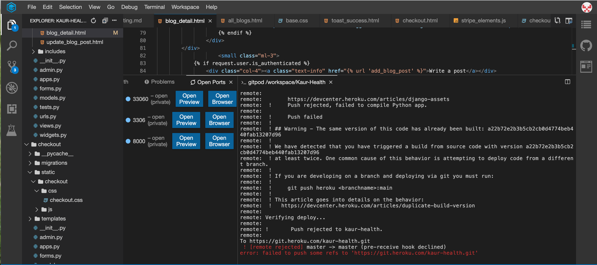
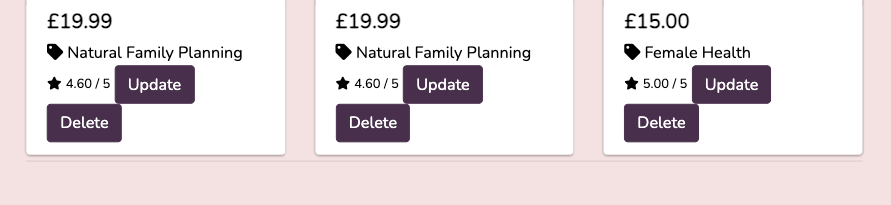

# Kaur health - Testing details

[Main README.md file](README.md)

[View website on Heroku](https://kaur-health.herokuapp.com/

## Table of Contents

## Table of Contents

1. [Automated Testing](#automated-testing)
    - [Validation services](#validation-services)
    - [Jasmine](#jasmine)
    - [Python Testing](#python-testing)
    - [Coverage](#coverage)
    - [Travis](#travis)
2. [User Stories Testing](#user-stories-testing)
3. [Manual Testing](#manual-testing)
    - [Testing undertaken on desktop](#testing-undertaken-on-desktop)
    - [Testing undertaken on tablet and phone devices](#testing-undertaken-on-tablet-and-phone-devices)
4. [Bugs discovered](#bugs-discovered)
    - [Solved bugs](#solved-bugs)
    - [Unresolved bugs](#unsolved-bugs)
5. [Further Testing](#further-testing)
    -[Accessibility](#Accessibility)


## Automated Testing

### Validation Services
The following validation services and linter were used to check the validity of the website code.

- [W3C Markup Validation](https://validator.w3.org/) was used to validate HTML. 

- [W3C CSS validation](https://jigsaw.w3.org/css-validator/) was used to validate CSS.

- [JSHint](https://jshint.com/) was used to validate JavaScript.

    - To save on loading times and to keep my JavaScript code organized I chose to break up the JS into several separate files. 
    - When running JSHint, the errors `undefined variable` and `unused variable` appear when one file either creates or uses a function that is utilized or created in another file. As validates one JS file at a time, it is not aware of the other files. 
    - To double-check that no errors occur with the entire files loaded I pasted in all the JavaScript code into JSHint and then it ran with no errors. 

- [Pylint-django](https://pypi.org/project/pylint-django/) was used to validate Python.

**IMPORTANT**

If you wish to run any of these tests for yourself, before going further please make sure you have already cloned this project from the [The House of Mouse GitHub repository](https://github.com/AJGreaves/thehouseofmouse) 
by following the steps in the [README.md](readme.md#how-to-run-this-project-locally) under "How to run this project locally" and that you have the entire project running on your own IDE.

### Python Testing

#### How to run Python tests

To run the existing Python tests:
1. Activate your virtual environment.
2. In the terminal enter the following command:
```
python manage.py test
```
3. If you wish to run the tests within a specific app only you can specify with: 
```
python manage.py test <app name here>
```
4. The test results will be shown within the terminal.

_NOTE: The `python` part of these commands assumes you are working with a windows operating system. Your Python command may differ, such as `python3` or `py`_


### A note about TDD

This project did not utilize Test Driven Development. The reason for this was that I was learning how Django works and functions and found it impossible to write tests for methods and classes that I did not understand well as I went along. 

The automated tests for this project were created after the vast majority of the project was already complete, once I had a firmer grasp of how my code was working and what its expected output was. Now that I have a better understanding of how automated tests work, I intend to attempt TDD with my next project.

### Coverage

[Coverage.py](https://coverage.readthedocs.io/en/v4.5.x/) was used to provide feedback during testing to check that enough of my code had been tested.

#### How to run coverage

1. Activate your virtual environment.
2. In the terminal enter the following command:
```
coverage html
```
3. Open the newly created `htmlcov` directory in the root of your project folder. 
4. Open the `index.html` file inside it.
5. Run the file in the browser to see the output.

### Travis

- [Travis](https://travis-ci.org/) was used throughout the unit testing of this project to provide continuous integration with the deployed site. The [Travis Documentation](https://docs.travis-ci.com/) provides all the info needed to set it up.
- I set the heroku deployment settings for this project to only allow deployment when the travis had passed the latest push to the master branch on GitHub.

## User stories testing

## Viewing and Navigation

| AS A/AN     | I WANT TO BE ABLE TO ... | SO THAT I CAN... |
| ----------- | ----------- | ----------- |
| Site User | Read all content clearly | Enjoy using the site. |


| AS A/AN     | I WANT TO BE ABLE TO ... | SO THAT I CAN... |
| ----------- | ----------- | ----------- |
| Site User | Access the website on both larger and smaller screened devices | Access the website on my phone and PC |


| AS A/AN     | I WANT TO BE ABLE TO ... | SO THAT I CAN... |
| ----------- | ----------- | ----------- |
| Site User | Be able to easily access information about Juspreet and the services she offers | Trust the validity of her and her services. |

- The about page is brief and informative, not only do users have access to information regarding Juspreet and her work, but they can find testimonies from clients too. 
- I feel the about page, fully satisfies this user story. 


| AS A/AN     | I WANT TO BE ABLE TO ... | SO THAT I CAN... |
| ----------- | ----------- | ----------- |
| Site User | Easily navigate to the Products and services available | Find the product or service I want to purchase |

- There is a search bar on the main nav bar which says `Search Products & Services`
).png)
- Products and services tab is clear and obvious on the nav bar.


| AS A/AN     | I WANT TO BE ABLE TO ... | SO THAT I CAN... |
| ----------- | ----------- | ----------- |
| Site User | See a shopping cart icon on nav bar | Always check the current order and check out when I want |

- The shopping cart icon is black when bag is empty, when bag has items; the bag becomes illuminated and reads the current total in bag. 

<br/>

## Online shopping 

| AS A/AN     | I WANT TO BE ABLE TO ... | SO THAT I CAN... |
| ----------- | ----------- | ----------- |
| Site User| Filter by a specific category | Easily find products in a specific category |

- When a user clicks on ` Product and services` dropdown nav bar option, you are given a dropdown to the different categories of the products and services. I thought that the dropdown would provide better user experience than a direct link, which takes you to a page where you then have to sift through the categories that you are interested in. The nature of this site, is such that, as a user, you are probably well aware of what you are looking for and therefore which category to find it. Or, if you are new to the site's content, I felt it would be less overwhelming if you have some filtering control and could navigate to the category you were most interested in. 
By doing this I satisfy the ease of navigation in my user stories and adhere to my wireframes. 
.png)
- After clicking on your chosen category, all of the products and services under this category, will be displayed. The category name will appear just beneath the consistent title of 'products and services' and there is a banner just above the title, with the free delivery minimum spend. 
In the top left corner the user will see a link to `Products and services home` which when clicked will take them to the `all products and services`, here all of the categories will be clickable links beneath the title, so that a user can navigate to the other categories from here as well/ instead of the navbar dropdown.
Beside the `Products and services home` there is a product and service count, outlining how many products and how many services belong to this category. 
).png)

Originally I toyed with the idea of having the product and service count clickable links and sectioning the page so that the user would be taken to a products section if they clicked the product count link to 'products' and the same for services. However, this proved to be bad UI, as when and if the user chose to sort the products, the sections would make things very messy and hard to contain. 
- It was through this boolean field, that I was also able to filter down to just the services. I simply added some code to my views and template so that just the services would be displayed when a user clicks on the services. 
I opted to distinguish services from products in a few ways;
1) Adding a consistent banner in each of the services' descriptions # picture
2) When a service is added to the user's bag, the success message will clearly state that the user has just added a service and should read the terms and conditions carefully. 
3) On the order receipt, I have again stated, which of the items are services and that the user should therefore read the terms and conditions. 

| AS A/AN     | I WANT TO BE ABLE TO ... | SO THAT I CAN... |
| ----------- | ----------- | ----------- |
| Site User | View individual product pages that have prices and descriptions | Get detailed information about the product before purchasing |

- The product detail page satisfies this user story. 
- For services, in particular, it was important that the user could access all necessary information. 

| AS A/AN     | I WANT TO BE ABLE TO ... | SO THAT I CAN... |
| ----------- | ----------- | ----------- |
| Site User | Leave/View product reviews with scores | Understand which products are popular with other customers |

- Site users can view ratings of each product, however as noted in the `features left to implement` section of the readme; in production, I quickly understood that the nature of this site is such that there needed to be a balance between business and community. The use of testimonies on the about page served as a review and in the future as the site grows I would consider adding a product review section and functionality.  

| AS A/AN     | I WANT TO BE ABLE TO ... | SO THAT I CAN... |
| ----------- | ----------- | ----------- |
| Site User | Easily update and remove a product | Make sure the online site has the latest catalogue |

- If the user is logged in as a superuser, Update / Delete option is also shown on each card.
).png)
).png)
).png)
).png)
).png)
).png)
).png)
- It was also necessary to add some defensive programming, to inform none admin users that they are not permitted to make any changes to the products, should a none admin user attempt it.
).png)

| AS A/AN     | I WANT TO BE ABLE TO ... | SO THAT I CAN... |
| ----------- | ----------- | ----------- |
| Site User | Easily add a new product | Make sure the online site has the latest catalogue |

- As explained in readme, when superuser is logged on, product management is accessible as dropdown link from `account` in nav bar. 
- this link will take admin straight to a new product form. 
).png)
).png)
).png)

<br/>

## Cart, Purchasing and Checkout

| AS A/AN     | I WANT TO BE ABLE TO ... | SO THAT I CAN... |
| ----------- | ----------- | ----------- |
| Site User | Easily select the quantity (if applicable) of a product after adding a product to a cart | Ensure I don't accidentally select the wrong product and the quantity |

- The quantity is set to a defualt of 1 and can be easily adjustable both in and out side of the bag. 
).png)
).png)
- Users are also given feedback messages when adjusting any of the items in their bags. 
- Items can be easily removed from the bag. 
).png)


| AS A/AN     | I WANT TO BE ABLE TO ... | SO THAT I CAN... |
| ----------- | ----------- | ----------- |
| Site User | Have my delivery information is prefilled if logged in | Smoothly proceed with my purchase |

- If users are authenticated, after their first order, their delivery information can be saved to their profiles. Users can update their details on their profile, this means the details will be updated for when the user carries out their next order.
).png)
).png) 


| AS A/AN     | I WANT TO BE ABLE TO ... | SO THAT I CAN... |
| ----------- | ----------- | ----------- |
| Site User | Be reminded to log in if I did not log in | Smoothly proceed with my purchase and prefilled form | 

- Beneath the order form there are links to either register for an account or log in. 
- I considered adding more reminders to log in for this functionality, throughout the site, however decided against it, as I thought this could attribute to bad UX. If a user feels that it is impossible to carry out the desired action, without being authenticated, this may dissuade them from visiting or more importantly, purchasing through the site again. 

<br/>

## Registration, User Accounts and User Community


| AS A/AN     | I WANT TO BE ABLE TO ... | SO THAT I CAN... |
| ----------- | ----------- | ----------- |
| Site User | Easily register for an account | Have a personal account where I can edit my information and access blog articles |

- users with a profile can edit their delivery information. 
- Initially, I had intended to make blog articles accessible for users only. However, during development, I decided against this as I felt this would negatively impact Juspreets exposure to brands and other potential clients (brand goals). 
- Blogs are accessible to all, however, only authenticated users can make a post or comment on a post. 
- To acknowledge this user story, if a user has written blog posts when they log on and click on the blog tab in the navbar they will see a dropdown link ` my blog posts `. Here they will find all of the posts that they have written. 
- Whilst my original idea hasn't been executed, I feel that what exists now is a better alternative and will result in a better UX. The user's personal blogs being accessed via the navbar is another way of satisfying the idea behind this user story. 
).png) 
).png)


| AS A/AN     | I WANT TO BE ABLE TO ... | SO THAT I CAN... |
| ----------- | ----------- | ----------- |
| Site User | View my order history | Purchase the same product again in the next order |

- This is achieved on the users profile page. 
).png)


| AS A/AN     | I WANT TO BE ABLE TO ... | SO THAT I CAN... |
| ----------- | ----------- | ----------- |
| Site User | Easily recover my password in case I forget it | Recover access to my account |
- Django all auth functionality covers this, I provided extra styling as default cut off the text. 


| AS A/AN     | I WANT TO BE ABLE TO ... | SO THAT I CAN... |
| ----------- | ----------- | ----------- |
| Site User | Receive an email confirmation after registering | Verify that my account registration was successful |
- Django all auth and Gmail functionality did most of the heavy lifting for this. Whilst Amazon email service did not work for me in this project, in the future I hope to use it, as using Gmail functionality would mean that I must always supply a Gmail account to become authenticated. 


| AS A/AN     | I WANT TO BE ABLE TO ... | SO THAT I CAN... |
| ----------- | ----------- | ----------- |
| Site User | Post a blog about any of my areas of expertise | Provide site visitors interesting information and hopefully make a sale as a result |

- As aforementioned, I thought it would be a good way to encourage more users and build an online community if users were only permitted to write blogs, if they were authenticated. 
- I convey this clearly throughout the site.
).png)
- Adding a post is easy to do. 
).png)
).png)


| AS A/AN     | I WANT TO BE ABLE TO ... | SO THAT I CAN... |
| ----------- | ----------- | ----------- |
| Site User | Add comments to the blog posts | Write down my thoughts on the post |

- Comments of a post can be viewed by all users, however, only authenticated users can add a comment. 
- If a user is authenticated they will see links to comment, if the user is not they will see links to `login and comment` which will direct them to the login. 
- Initially, instead of links I had an alert message which was triggered if a none authenticated user attempted to comment. However, I changed this, as the nature of 'topical comments' are such that, the user will want to quickly express whatever feeling/ response, the post had evoked in them. I felt an alert message was a little vague and would contribute to bad UX. the user could likely be confused as to what to do next? Whereas a link will direct them to the login page, where they are on a mission to comment. 

| AS A/AN     | I WANT TO BE ABLE TO ... | SO THAT I CAN... |
| ----------- | ----------- | ----------- |
| Site User | Remove unsavoury comments | Protect my brand and the site visitors' experience |

- I did not have time to add this in, however in the future I will. 
<br/>


# Manual testing

Below is a detailed account of all the manual testing that has been done to confirm all areas of the site work as expected.

### Testing undertaken on desktop
All steps on desktop were repeated in browsers: Firefox, Chrome and Internet Explorer and on two different desktop screen sizes.

#### Elements on every page
1. Navbar

- Clicked each link in the navbar to confirm that it leads to the correct page.
- Confirm that when logged out the options "Register" and "Log in" are visible and that "Account" and "Log out" are not.
- Log into the site, confirm that options "Account" and "Log out" are visible and that "Register" and "Log in" are not.
- Click the "Products & Services" link in the navbar, confirm that all categories pertaining to the Products & Services are listed in the dropdown menu.
- Add an item to the users bag, confirm that the counter appears over the shopping cart icon with the correct number of items displays.
- Delete all items from the users cart, confirm that the cart icon is no longer illuminated with the bag total.


2. Search bar

- Enter a search word that applies to many listings.
- Confirm that the listing returned match the search term.
- Enter a search word that does not apply to any listings. Confirm that the message "0 Products found for "x" 0 Services found for "x"" is displayed when hitting enter.

3. Footer

- Hover over links in the footer, confirm the color change animation works as expected.
- Click all links in the footer, confirm that contact icon takes the user to the contact form within the site.
- Click the social icons, confirm that they open in a new tab and takes the user to the relevant sites.
- Check date of copyright information, confirm year displayed matches the current year.

#### Home Page
1. Call to action buttons

- Hover over all buttons, confirm the color change and shadow on hover appear as expected.
- Click all buttons, confirm they take the user to the correct links and open new tabs when links go away from the website.

2. Specialisms section

- Ensure all images are displaying at uniform height and width.
- text is spell and grammar checked

3. Testimonials carousel

- Click carousel buttons, confirm that they work as expected.
- Check each slide to be sure the elements fit within the slider.

#### Products and services page 

1. Display of all items 
- Confirm that on desktop 4 products are visible in one row.
- Confirm that on tablet 2 products are visible in one row.
- Click each product card, confirm that it takes the user to the relevant product detail page.

2. Sorting options

- Select the different sorting options from the menu one by one, confirm that the products are sorted in the orders selected.

3. Product cards

- Hover over product cards, confirm the hover effect works as expected.
- Confirm that the photos, images and prices displayed are correct.
- Click multiple products, confirm that the user is taken to the correct product listing pages.
- Confirm that one of each product is displayed in total.
- Check that there are no duplicates or missing products.
- Click the quantity selection. Confirm that the highest number available to select is 99.

4. Add to bag button
- Click the "add to bag" button. Confirm that the applicable message is launched, stating the name of the product added to the cart, and that the cart counter in the navigation bar is updated to reflect the new quantity.
- Confirm that the modal provides two buttons to the user: to go to bag or to continue shopping. Click both to confirm they operate as expected.
- Add more of the same product to the bag, confirm that the user is receiving adequate messages of the changes they are making to the bag. Product and service count being updated accordingly.


#### Bag page 

- Go to the cart page when not logged in to the site, confirm that the message "Your cart is empty!" is shown and the call to action button “keep shopping" is provided.
- Go to the cart page when logged in to the site, confirm that either the message "Your cart is empty!" is shown, or that your bag items are displayed.
- Click the button and confirm it takes the user to the main shop page.
- Add items to the cart and return to the cart page, confirm that all items in the cart are displayed correctly, with the correct amounts requested by the user.
- Adjust the quantity field, confirm that the shopping cart subtotal is updated to reflect the change.
- Adjust the quantity field up higher than 99. Confirm that a modal alerts the user to choose a quantity within range 1-99.
- Click the remove button on a bag item, confirm that the cart page is reloaded with that item removed from the cart and user receives an informative message.
- Delete all items from the cart, confirm that the cart page is reloaded to reflect the empty cart.

#### Checkout Pages
1. checkout page
- Navigate to the checkout page urls without anything in the cart. Confirm that the user is redirected to the all items page, with an error message "It looks like theres no items in your bag yet!"
- confirm that user is taken to page with shipping form on left and order summary on right. 
- confirm that shipping form is prefilled, if user is logged in and that 'save info' is checked.
- confirm that shipping form is empty if user is not logged in and thatthere is a link beneath form reminding user to log in to this form prefilled. Or register. 
- confirm adjust bag button takes user bag to bag. 
- confirm secure complete order button, completes order. 
- Use the stripe checkout test card numbers to check the various responses to different errors.
- Make a successful payment. Confirm that the user is returned to checkout success page.
- confirm overlay and loading spinner successfully display whilst payment is going through.

2. Checkout success page
- Check that the success page loads as expected.
- Confirm that the user sees a sucess message in top right with order number and email address.
- Check that the invoice form is displayed correctly and clearly with all relevant values.
- Click the "back to the shop" button, confirm that the user is taken back to the main shop page.
- Confirm order confirmation email is received.
- Check that the relevant description is displayed for item type (product/ service)

#### Contact Page
1. contact form 
- Go to the contact page. Confirm that the contact form is laid out as expected.
- Try to send the form with no fields filled in, confirm that the user is alerted to fill in the required fields.
- Try to enter a non-email address into the email field, confirm that the user is alerted to fill in an email address.
- Send a complete form, confirm that the message is sent to my email address with all the information included.
- Go into dev tools, change the hidden form value attribute from number to something and ensure that Django honeypot field catches the spam attempt and returns user to an error page.

2. form submission response
- Check user receives a success message and is redirected to a response page, where they are notified that they will be receiving a response in 2-3 working days.
- Ensure user receives a copy of their contact form by email. 

#### Blog Page
1. All blogs 
- Check all blogs are clearly listed and there are no image overspills. 

2. Blog detail
- Confirm correct buttons appear and that they work correctly 
- Check that the comments display where applicable and that authenticated users can add them. 

#### Django Allauth pages 
1. Register Page
- Try to go to the register URL when already logged in, confirm that the user is redirected to the home page.
- Log out then go to the register page again. Confirm that the registration form is displayed as expected.
- Fill in the form with a username already in the database, confirm that the user is informed that they must use a unique username.
- Fill in the email input with a non-email address, confirm the user is shown an error asking the to use an email address.
- Go into devtools, change the type attribute on the email form to text, attempt to send the form. confirm that the Django validation catches the error and tells the user to enter an email address.
- Fill in the form with two different passwords, confirm the error is caught again and the user is informed of their mistake.
- Fill in the registration for correctly, confirm that the user is automatically directed to the login page, and the message "Your account has been created <username>. You can now log in." is displayed above the login page.

2. Login Page
- Reload the login page, confirm that the message for a new account is not visible.
- Attempt to log in with a username not in the database, confirm the relevant error message is shown.
- Attempt to log in with a correct username but wrong password, confirm the relevant error message is shown.
- Log in with a correct username and password, confirm that the user is logged in and that they are redirected to their cart page.
- Try to return to the login page URL when already logged in, confirm that the user is redirected to the cart page.

3. Account Page
- Go to the account page of a newly created user. Confirm that the profile info form is populated with the users' username and email address.
- Confirm that the first name and last name fields are also available.
- Fill in the form with a non-email address, confirm that the applicable error is shown to the user
- Fill in the form correctly, confirm that the "Your account info has been updated." message is shown to the user and that the reloaded form is now populated with the new data.
- Make 2 separate orders on the website.
- Return to the account page, confirm that the orders are displayed in the Orders section of the account page. With the top order being the most recent and open to show the full details. 
- Confirm that all orders after it in the list are closed accordions, but that can be opened with a click.
- Confirm that all data in the orders on the account page is accurate.

4. Log Out Page
- Add a new product to the users' cart. Click the "log out" link in the navigation bar. Confirm that the user is logged out and their cart has been cleared.
- Click the "Log in again" link on this page, confirm that the user is taken back to the login page.
- Confirm that the footer stays stuck to the bottom of the screen even when there is not enough content on the page to push it down.


### Testing undertaken on tablet and phone devices
All steps below were tested in the Chrome Developer Tools device simulators on all options and orientations.

#### Elements on every page
1. Navbar
- Open the website on mobile, confirm that the navbar is collapsed into a burger icon
- click the burger icon, confirm that the navbar list appears are expected.
- Click the "Products and services" dropdown menu, confirm that the products are displayed.
- Add something to the cart, confirm that the user shopping cart icon counter appears and displays correctly.

2. Footer
- Scroll to the bottom of the page, confirm that the footer contents is displayed as expected with the bootstrap grid.
- No content squashed or squeezed or disproportionate in size.
- Confirm that all links and buttons in footer are easy to click with a finger on the smallest screen sizes.

#### Products and services pages

- Confirm that the products are displayed one on top of each other on mobile, and 2 to a row on tablet.
- Confirm that all clicks operate as expected on touch screen.

#### Checkout pages

- Confirm that the order summary is displayed as a closed accordion, and can be opened with a click.
- Check that the display of elements matches the expected layout for mobile and tablet devices.

#### All pages

- Navigate to all pages on the site, check that the layout is as expected for the screen size.
- Check that all buttons, menus, forms and other elements are the correct proportions and easily clickable with a finger.


# Bugs discovered

## Solved Bugs
## Bug 1 - Service details not showing up 
Solution: Correct the URLs for the app
- I have three models categories, services and products. Products and services rely on the categories model. 
- When I built the template for the product and service details, the product detail worked fine, but the service details would not. 
- if I clicked on a service, I would be taken to the details of a product with the same pk as the service I had clicked on. 
- I thought it was an issue with the primary keys, but I couldn't work out what the issue was because the primary keys were from different models. 
- In an attempt to rule this out, I displayed the ids (primary keys) of each service using 
``` {{ service.id }} ```
- Then I changed the pk of one of my services to a number that was entirely different to any of the pk values of the products or services. 
- when I clicked on this service, I got an error.

- This told me, the service details were reliant on the product id's. The new pk of the service I had tried to access, was out of range of the current product ids.
- this led me to check the link path of the items when they were clicked. this revealed all items were following the ``` all_items/<pk_value> ``` path. 
- this in turn led me to change my products and services app URLs from 
``` path('<int:product_id>/', ```
```        views.product_detail, name='product_detail'), ```
``` path('<int:service_id>/', ```
```        views.service_detail, name='service_detail'), ```
 to 
``` path('product_detail/<int:product_id>/', ```
```        views.product_detail, name='product_detail'), ```
``` path('service_detail/<int:service_id>/', ```
```        views.service_detail, name='service_detail'), ```
- this solved the issue


## Bug 2 - Multiple items added to the bag each time a product/ service was added.  
Solution: add if statement in the contexts.py file


- I have 2 models that I needed to pull data from, this means I need to specify with actions if I am pulling data from the service_id or the product_id.
- My Products and Services had identical pk's, I didn't think this was an issue because they were still two different models, however, with this issue arising, I decided to change the services' pks.

- First, I changed the pks of my services. To do this I, mistakenly used the `loaddata` command. This indeed added the services with new pks, however didnt UPDATE, I was left with two sets of services.. To resolve this I had to manually delete ALL of my services, via the admin on my site and then `loaddata` again. 
I researched and found out that to update models, you need to update the migrations used. I will do this if the issue arises again in the future, as it saves time. 
- Changing the pk's led to me continually getting this error 
.png)
<br>
when I tried to add a product or service. If I added a product, the error would say 'no service matches your query' and if I added a service, the error would say 'no product matches your query'.

- I believed my issue was in my views and URLs and started to separate the logic. 
```
 def add_product_to_bag(request, item_id):
    '''Add a quantity of the specified product to the shopping bag'''
    product = Product.objects.get(pk=item_id)
    quantity = int(request.POST.get('quantity'))
    bag = request.session.get('bag', {})

    if item_id in list(bag.keys()):
        bag[item_id] += quantity
        messages.success(request,
                         f' Updated {product.name}'
                         f'quantity to {bag[item_id]}')
    else:
        bag[item_id] = quantity
        messages.success(request,
                         f' {product.name}'
                         ' added to your bag! ')

    request.session['bag'] = bag
   print("here")  
 return redirect("view_bag") 
 ```
 ```
 urlpatterns = [
    path('', views.view_bag, name='view_bag'),
    path('add_product/<item_id>/',
         views.add_product_to_bag,
         name='add_product_to_bag'),
```
- I was still getting the error, so concluded that I needed to define the item specifically to check if it's a service or product. To do this I added a parameter of `product.id` in the add product to bag view, however, I would get this error;
.png)

- Eventually, after I had made all of the changes I could think of, to my views and URLs, I took a look at the `contexts.py` file. <strong> In hindsight, I should have looked at this file earlier on in the process, as it was the only other file in the bag app, which handled functions specific to the bag. </strong>  
- In the `contexts.py` file;
I changed the `bag contents` method from 
```
def bag_contents(request):
    bag_items = []
    total = 0
    product_count = 0
    service_count = 0
    bag = request.session.get('bag', {})

    for item_id, quantity in bag.items():
        product = get_object_or_404(Product, pk=item_id)(pk=item_id)
        service = get_object_or_404(Service, pk=item_id)
        total += quantity * product.price
        total += quantity * service.price
        service_count += quantity
        product_count += quantity
        bag_items.append({
            'item_id': item_id,
            'quantity': quantity,
            'product': product,
            'service': service,
        })

    if total < settings.FREE_DELIVERY_THRESHOLD:
        delivery = total * Decimal(settings.STANDARD_DELIVERY_PERCENTAGE / 100)
        free_delivery_delta = settings.FREE_DELIVERY_THRESHOLD - total
    else:
        delivery = 0
        free_delivery_delta = 0

    grand_total = delivery + total

    context = {
        'bag_items': bag_items,
        'total': total,
        'product_count': product_count,
        'service_count': service_count,
        'delivery': delivery,
        'free_delivery_delta': free_delivery_delta,
        'free_delivery_threshold': settings.FREE_DELIVERY_THRESHOLD,
        'grand_total': grand_total,
    }
    return context

```
to: 
```
def bag_contents(request):
    bag_items = []
    total = 0
    product_count = 0
    service_count = 0
    bag = request.session.get('bag', {})

    for item_id, quantity in bag.items():
        product = Product.objects.filter(pk=item_id).first()
        if product:
            total += quantity * product.price
            product_count += quantity
            bag_items.append({
                'item_id': item_id,
                'quantity': quantity,
                'product': product,
            })
        else:
            service = get_object_or_404(Service, pk=item_id)
            total += quantity * service.price
            service_count += quantity
            bag_items.append({
                'item_id': item_id,
                'quantity': quantity,
                'service': service,
            })

    if total < settings.FREE_DELIVERY_THRESHOLD:
        delivery = total * Decimal(settings.STANDARD_DELIVERY_PERCENTAGE / 100)
        free_delivery_delta = settings.FREE_DELIVERY_THRESHOLD - total
    else:
        delivery = 0
        free_delivery_delta = 0

    grand_total = delivery + total

    context = {
        'bag_items': bag_items,
        'total': total,
        'product_count': product_count,
        'service_count': service_count,
        'delivery': delivery,
        'free_delivery_delta': free_delivery_delta,
        'free_delivery_threshold': settings.FREE_DELIVERY_THRESHOLD,
        'grand_total': grand_total,
    }
    return context

```
- In the original method, essentially, I had stated that 'to add an item to the bag contents, there needed to be both products and services'. This is why originally, two items would simultaneously be added to the bag and thereafter I got the query error. 
- the change to the contexts.py solved the issue. 

## Bug 3 Unable to correctly format the bag_contents
Solution: created empty arrays for both products and services, within bag_items and appended products to the bag_items, to help decipher which item was coming from where. Then iterate through the new array in the template. 

- After solving the above issues, I realised that with every item added, an extra empty row was added, because the server was being told to look for a product AND service every time, by the contexts.py file. 
.png)
- I didn't understand the lack of the separation of the models and their endpoints as much as I do now, I thought that because I had separated the products and services actions eg 
``` add_product_to_bag and add_service_to_bag ```
that this was sufficient.
- So I thought I could separate the products and views from the template. 
.png)
- However, this still gave the same errors that I had previously seen
.png)
and led to only the products or services displaying at any one time, not together and seamlessly. 
Here you can see from the total that there are other items in the bag (services) however only the products show until you remove the products, then the services are displayed. 
- I realised I needed to go bag into the view_bag view and contexts.py file, both of which currently had little to no differentiation between items being products or services. 
.png)
I changed the view_bag view to 
``` 
def view_bag(request):
    bag_items = {
        'products': [],
        'services': [],
        }

    return render(request, 'bag/bag.html', bag_items)
    print(request.session.get('bag', {})) 
```
Similarly, the bag_contents in the contexts.py file was 
```
def bag_contents(request):
    bag_items = []
    total = 0
    product_count = 0
    service_count = 0
    bag = request.session.get('bag', {})
    print("hello im working2")
    for item_id, quantity in bag.items():
        product = Product.objects.filter(pk=item_id).first()
        if product:
            total += quantity * product.price
            product_count += quantity
            print("hello im working3")
            bag_items({
                'item_id': item_id,
                'quantity': quantity,
                'product': product,
            })
            print("hello im working1")
        else:
            service = get_object_or_404(Service, pk=item_id)
            total += quantity * service.price
            service_count += quantity
            bag_items({
                'item_id': item_id,
                'quantity': quantity,
                'service': service,
            })
        print("hello im working")
    if total < settings.FREE_DELIVERY_THRESHOLD:
        delivery = total * Decimal(settings.STANDARD_DELIVERY_PERCENTAGE / 100)
        free_delivery_delta = settings.FREE_DELIVERY_THRESHOLD - total
    else:
        delivery = 0
        free_delivery_delta = 0

    grand_total = delivery + total

    context = {
        'bag_items': bag_items,
        'total': total,
        'product_count': product_count,
        'service_count': service_count,
        'delivery': delivery,
        'free_delivery_delta': free_delivery_delta,
        'free_delivery_threshold': settings.FREE_DELIVERY_THRESHOLD,
        'grand_total': grand_total,
    }
    print(request.session.get('bag', {}))
    return context

```
Which I changed to 
```
from django.conf import settings
from decimal import Decimal
from django.shortcuts import get_object_or_404
from products_and_services.models import Product, Service


def bag_contents(request):
    bag_items = {
        'products': [],
        'services': [],
        }
    total = 0
    product_count = 0
    service_count = 0
    bag = request.session.get('bag', {})
    print("hello im working2")
    for item_id, quantity in bag.items():
        product = Product.objects.filter(pk=item_id).first()
        if product:
            total += quantity * product.price
            product_count += quantity
            print("hello im working3")
            bag_items['products'].append({
                'item_id': item_id,
                'quantity': quantity,
                'product': product,
            })
            print("hello im working1")
        else:
            service = get_object_or_404(Service, pk=item_id)
            total += quantity * service.price
            service_count += quantity
            bag_items['services'].append({
                'item_id': item_id,
                'quantity': quantity,
                'service': service,
            })
        print("hello im working")
    if total < settings.FREE_DELIVERY_THRESHOLD:
        delivery = total * Decimal(settings.STANDARD_DELIVERY_PERCENTAGE / 100)
        free_delivery_delta = settings.FREE_DELIVERY_THRESHOLD - total
    else:
        delivery = 0
        free_delivery_delta = 0

    grand_total = delivery + total

    context = {
        'bag_items': bag_items,
        'total': total,
        'product_count': product_count,
        'service_count': service_count,
        'delivery': delivery,
        'free_delivery_delta': free_delivery_delta,
        'free_delivery_threshold': settings.FREE_DELIVERY_THRESHOLD,
        'grand_total': grand_total,
    }
    print(request.session.get('bag', {}))
    return context

```
By adding products and services as empty arrays, I could append them to the bag_items, depending on their condition and iterate through them in the template.

- I changed the template logic to 
```
                    
                    <!--products in the bag -->

                    
                    

                    <!--services in the bag -->

                    
```

and got this error
.png)

Django and python don't like [''], within for loops 

so I changed it to 
```
                    
                    <!--products in the bag -->

                    
                    

                    <!--services in the bag -->

                    
```

which worked and my server is no longer looking for a product AND service every time an item is added.
.png)


## Bug 4 Cannot render images in bag
Solution: change pathway from 
```
<td class="p-3 w-25">
                            
                            
                            
                            
                            
                        </td>
```
.png)

To
```
<td class="p-3 w-25">
                            
                            
                            
                            
                            
                        </td>
```
.png)

I used dev tools to compare the pathway written in the image source, on all_items.html and bag.html and quickly realised that i needed to use the exact field name from my models. 


## Bug 5 card number input field not working
solution: Typed '66' which triggered the num lock and was then able to type valid and invalid card numbers. 

I discovered this issue after adding the intial stripe functionality. 

I used dev tools to try and debug the issue, I assumed it was a styling overlap error at first. 

I could see the input was very cluttered with styles and believed this had something to do with the bug. 
.png)

I made my port public, removed the environment variables from a previous project (in case there was confusion in the application of public and secret keys ) and looked into the ad-block settings in my browser (chrome).

I then tried to input a card number into the mini project deployed site and another completed MS4 site. Both of which were not working! 
.png)
.png)

I was then convinced that it must be an ad setting in chrome somewhere, however, to disable all security against the pop-ups, would not be wise..

Finally, it was suggested that I type '66' into the card number field. 
.png)

Initially, I thought I may have some numbers on my keyboard not working, however after typing '66' I was able to type every number. 
I then concluded that I had been trying to enter the numbers using the number keypad without Num Lock turned on. '66' triggered the num lock and 77, 88, would have been just as effective! 

## Bug 6 Unable to correctly render the checkout success page
solution: change the entire structure, by having one model!
- I was building the checkout logic, trying to replicate the logic from my contexts.py file, however, my contexts.py file was very specific to my two models. I was stumbling with the order_line_items.

.png)
.png)

- I thought I needed to create a similar variable as bag_items for order_line_items. I started looking into this and realised just how complicated the logic was becoming..
.png)

- I continued to try and define the quantity, continuing to try and keep the products and services seperated. 
.png)
.png)

- eventually, I was advised to change my model structure or discuss it with my mentor at least. I was very disheartened by this at first, but it was a great learning curve for me. We are taught KISS from the first lessons on the course and, I find myself straying and not abiding by DRY. 
.png)

- To honour the importance of separating the products and services, I added a boolean field to the product model
```
service_category = models.BooleanField(default=False, null=True,
                                           blank=True)
```
However, I wasn't sure how to list this field in the order model, in the order_line_item class, in the checkout app. 
.png)

- I tried and it worked! 

## Bug 7 - updating add to bag view, so that service count is functional and messages relay service specific information
solution: correct logic in the view

- I adapted and used the logic from the mini project and tried to correctly define each eventuality of services being added to bag, with if statements. 
```
def add_product_to_bag(request, item_id):
    '''Add a quantity of the specified product to the shopping bag'''
    product = Product.objects.get(pk=item_id)
    redirect_url = request.POST.get('redirect_url')
    quantity = int(request.POST.get('quantity'))
    service = bool(request.POST.get('product_is_service'))
    bag = request.session.get('bag', {})

    if service:
        if item_id in list(bag.keys()):
            if item_id in bag["services"]:
                bag["services"][item_id] += quantity
                messages.success(request, f' Updated service {product.name}'
                                 f'quantity to {bag[item_id]}'
                                 '[item_is_service"][service]!')
            else:
                bag[item_id]['product_is_service'][service] = quantity
                messages.success(request, f'added {product.name}'
                                 'to your bag! Please read the'
                                 'rules regarding services!')
        else:
            bag["services"] = {item_id: quantity}
            messages.success(request, f'added {product.name}'
                             'to your bag! Please read the'
                             'rules regarding services!')
    else:
        if item_id in list(bag.keys()):
            bag[item_id] += quantity
            messages.success(request, f' Updated {product.name}'
                             f'quantity to {bag[item_id]}')
        else:
            bag[item_id] = quantity
            messages.success(request, f' {product.name} added to your bag!')

    request.session['bag'] = bag
    print(bag)
    return redirect(redirect_url)
```
.png)
.png)
.png)
.png)

- I struggled to understand how to add to the dictionary, with a sub dictionary. To better understand the logic I loaded python in my cli and practised 
.png)
I finally understood that I needed to do 
dict[key] = value

- However, my code was still wrong and the if statement that handled the eventualities of a service being added to the bag, was getting completely skipped and the only logic was coming from the else block. 
.png)
.png)

- I then went to my Product_detail.html template, where I passed in `product_is_service` 
After more debugging and adjusting, I learnt that the issue was not that `product_is_service` was not being recognised/ passed in, but was definitely within my code, in views. 

- FINALLY, after trial and error, debugging and support from peers.. I was able to understand that I needed a sub dictionary WITH a sub array inside. My current subdictionary 
``` 
bag["services"] = {item_id: quantity}
``` 
was throwing errors because a) plural of service was not a wise choice for the name. b) it was not nested correctly.
The correct sub dictionary also had an array within it

```
bag[item_id] = {'item_is_service': {product.name: quantity}}
```
- After making these adjustments, the correct messages were displaying. To solve the service count issue, I simply added the variable service_count into the else block for my service logic in the contexts.py file. 


## Bug 7 - 'This is a service' message displaying on order summary 
solution: assessed the logic necessary for the desired outcome, adjusted the html template. 
- I followed the logic from the mini project to help achieve functionality for my boolean field on the product model. 
```
    service_category = models.BooleanField(default=False, null=True,
                                           blank=True)
```
I thought it was necessary for me to also add the new subdictionary 
```
'item_is_service'
```
to the order line item model, so that it would come up on the order summary. 
- I was trying to work out which field would be best, because I thought it was no longer a boolean field, because the boolean had already served its purpose, it was different to the example, because my boolean, did not serve as an input elsewhere. 
- After taking heed of the errors I have already made by not adhering to KISS, I reviewed the situation and realised that I didn't need to do ANYTHING to the order line item class and instead, just needed to put an if statement in the checkout success template. 

```

                        {{ item.product.name }}
                        <p>PLease rememebr the t's and c's</p>
                        
```

## Bug 8 - name not prefilled at checkout
.png)
.png)
.png)
.png)

after playing around with this issue some more, I concluded that to automatically update the order form and subsequently, profile details, with the users full name, from their first transaction; I would have had to collect that information when they signed up. 

The sign up form does not collect their full name, only username and email address. The email address was an easy fix, however full name was uncooperative. 

Therefore to resolve this, I would need to extend the user model (using a class called 'abstract based user' ) this will let you customise user model and add first name and last name as required field for sign up. 
Then, I could use that data for the profile and the form would be prefilled from the first transaction. 

## Bug 9 - filtering the users blog posts
- I wanted to add a dropdown for users who are logged in, to view their blog posts. 
- The first step to doing this was; specifying in the main nav that the 'my blogs' link would pertain to author equaling the user. 
```
            <div class="dropdown-menu border-0" aria-labelledby="#">
                <a href="" class="dropdown-item">All blog posts</a>
                
                    <a href="?author={{ request.user }}"  class="dropdown-item">My blog posts</a>
                
            </div>
```
- then I needed to do the back end work, which wasn't as simple because the blogs were displayed via a class as opposed to a method. 
- I had to use a method within the class
```
class HomeView(ListView):
    model = BlogPost
    template_name = 'blog/all_blogs.html'

# This method was used to place the filter on the main nav link. 
    def get_queryset(self):
        author_val = self.request.GET.get('author', '')
        if author_val:
            author_object = User.objects.get(username=author_val)
# Here I am adding 'author' to a new context (returned if 'my blogs' in nav is selected) 
            new_context = BlogPost.objects.filter(
                author=author_object,
            )
        else:
            new_context = BlogPost.objects.all()
        return new_context
 ```
 - This worked, however, it was easy to change name of the user to potentially view all the blogs, written by other users. 
 .png)
 .png)
 .png)
 .png)
 .png)

- I needed to add another method, beneath the query set, so that I could add the new object('author') onto the context 
```
# This method was used to get the above context. 
    def get_context_data(self, **kwargs):
        context = super(HomeView, self).get_context_data(**kwargs)
        context['author'] = self.request.GET.get('author')
        return context
```
- I also needed to accompany this new logic, with some logic in the all blogs template. 
.png)

- Now the user is unable to manually change the URL, to attain another users' blogs. 
.png)


## Bug 10 add blog URL not working, since slug implementation 
I needed to change my blog detail page URL from 
```
urlpatterns = [
    path('', HomeView.as_view(), name='blog'),
    path('/<slug:slug>/', BlogDetailView.as_view(), name='blog_detail'),
    path('new/', views.add_blog_post, name='add_blog_post'),
```
to 
```
urlpatterns = [
    path('', HomeView.as_view(), name='blog'),
    path('detail/<slug:slug>/', BlogDetailView.as_view(), name='blog_detail'),
    path('new/', views.add_blog_post, name='add_blog_post'),
```
The blog detail path, with just slug: slug, was throwing django off because the value of slug is just words and no actual path. without detail / before the slug:slug, when a user would try to add a blog post, the URL, was referring to the above view/ URL. I needed to distinguish them, so. I added the 'detail/'

## Bug 11 sending email attempt rejected due to the region. 
- After setting up amazon aws SES backend email functionality, I tested an email in the python shell. It did not work. 
-.png)
- I had already verified my email, so knew it wasn't that. 
- .png)
- After doing some research I found two other variables that were necessary for amazon to know the region I was in when sending the email. 
- .png)
- After changing these variables and restarting the testing process, I successfully recieved the message.
- .png)
- However, after reading the documentation around aws ses regions, I was aware that I needed to request to not be in a 'sandbox' that way I would be able to send emails to any email address (as opposed to solely the email address I had verified.)
- To resolve this issue, all I needed to do, was follow the given steps. 
- .png)

## Bug 12 Deployment errors solution: update aws keys, add static root.
- As I already set up a user so that I could access the amazon aws SES email functionality, I had some confusion over which aws settings to add. 
- When I began deployment, I got the user I had made for the email purpose ( which was not in a group ), looked at the permissions of the user, and simply added that permission to the user in the group in my bucket. 
- .png)
- When i tried to deploy I got a few errors, one being an unrecognised AWS_ACCESS_KEY_ID. This made sense because, the AWS_ACCESS_KEY_ID and AWS_SECRET_ACCESS_KEY in my heroku and env settings, were that of the user I had now deleted. 
- .png)
- I ran the deployment again and got another error, this time about the static root.
- .png)
- I did some research and read [ this ](https://docs.djangoproject.com/en/dev/ref/settings/#static-root) and added 
```
STATIC_ROOT = os.path.join(BASE_DIR, 'staticfiles')
```
to my settings.py file. when setting your static root, a common mistake is setting the name to 'static' however, this will throw an error as 'static' will refer to your 'STATICFILES_DIRS' variable. 
After changing these variables, I successfully deployed. 
On reflection, I will ensure that with future projects I deploy a lot earlier into the journey than I have with this project. Although I am still not quite finished and it is a weight off my shoulders, it would have been even better to iron out these issues and learn about things like the static root variable, even earlier in the project. 

## Bug 13 modal confusion errors
- Initially, I had thought it was good UX to have the action options; edit, delete and comment, accessible on all blog pages (all blogs, my blogs, blog detail).
- This was fine for the update and comment options, but if the user hit delete, I wanted to add a modal in so that the user could double check whether they wanted to delete. 
- The modal relies on links that exist inside the for loop, therefore, if I placed the delete confirmation button (linked to the modal) in the loop and the modal outside the loop. The confirmation button and relative data-target, toggle etc, were not recognised and would throw a loop. 
- An obvious solution would be to place the modal functionality inside the loop, however, this would result in generating a modal for all of the products on the page, which would undoubtedly lead to many bugs. 
- I decided that it was arguably better to have all the action buttons in one destination and UX would not be damaged if, edit delete and comment functionality was only accessible via blog detail. 
- However, when it came to the same logic for confirming delete modal for the store items (accessible to admin user) I felt it was none negotiable that the admin should be able to delete an item from both the all items and product detail page. 
- again, this was straight forward on the product detail page, because the functionality is only referring to ONE item, however, I ran into errors on the all items page. 
- .png)
- To solve this I added a hidden form into the modal.
```
<div class="modal fade" id="deleteModal" data-backdrop="static" data-keyboard="false" tabindex="-1"
    aria-labelledby="deleteModalLabel" aria-hidden="true">
    <div class="modal-dialog modal-dialog-centered">
        <div class="modal-content text-black">
            <div class="modal-header">
                <h5 class="modal-title" id="deleteModalLabel">Are you sure you want to delete?</h5>
            </div>
                <div class="modal-footer">
                    <form id="delete-form" method="POST" action="">
        
        <input type="hidden" name="id-selected" id="id-selected">
        <input type="hidden" name="redirect_url" value="{{ request.path }}">
        <input type="submit" value="Confirm Delete" class="btn btn-danger">
       <button type="button" class="btn-success btn" data-dismiss="modal" aria-label="Close"> No
                </button>
    </form>
                </div>
        </div>
    </div>
</div>
```
- Made a new view with a corresponding URL 
```
def confirm_delete(request):
    """
   confirm delete
    """
    if request.method == 'POST':
        selected = request.POST.get('id-selected')
        product = get_object_or_404(Product, pk=selected)
        product.delete()
        messages.success(request, f' {product.name} has been deleted')
    redirect_url = request.POST.get('redirect_url')
    return redirect(redirect_url)
```
- Finally, used Jquery to complete the action and direct the functionality 
```
    <!-- delete modal -->
    <script type="text/javascript">
    $(".js-delete").click(function () {
        var productId = $(this).attr("data-value");
        $("#id-selected").val(productId)
    });
    </script>
```
- It has become clear throughout this project, that whilst Django is a very helpful framework, its limitations lie within the difficulty to apply specific actions to more than one item, hence why it is easier to have detail pages for each item/ blog. I could have decided to simply have the delete functionality on the product detail only, however, I truly believe it is better UX for the delete to be accessible in all items. Moving forward, I would spend more time learning AJAX, which i know would have come in handy here. 

## Bug 14 deployed heroku site error
- I was repeatedly getting this error after pushing to heroku master, to see the changes made to my site. 

- I came across [this](https://stackoverflow.com/questions/63639673/heroku-deploy-error-remote-rejected-master-master-pre-receive-hook-dec) article on slack overflow and tried it 


## Unresolved Bugs

### Bug 1 aws email 
- Despite wanting to use aws for my email functionality, I was denied my request to leave the sandbox.
- I continued to dipute this, howevere gave up in the interest of time. 
.png)
.png)
.png)
.png)

### Bug 2 Update and delete buttons on smaller devices 
- the udpate and delete buttons are not inline on some smaller devices.
- I tried to rectify this by making both the buttons links with the smae classes, howver this prooved ineffective. functionality still works well! 
- 
# Further testing 
Used peer code review channel in slack

Kaur Health viewed on all devices and orientations available in Chrome DevTools.

## Accessibility
* I used [wave](https://wave.webaim.org/) to achieve better accessibility on my site. 

- wave test on each page revealed:
- 2 contrast errors, when using red text on the bag and checkout pages. 
- Inputs with class 'form-control', not having corresponding labels. I decided that these were not big issues as in each case, the placeholder text was there to inform a visually impaired user. 
- Empty buttons, where the button content is an icon. Again, I felt this was not a big issue, as the icon was there to indicate the action to the user, however as an extra measure, I added aria-labels to each of these icons. 


> [To return to the previous document please click here](https://github.com/mayasaffron/self-isolation-watch/blob/master/README.md) 