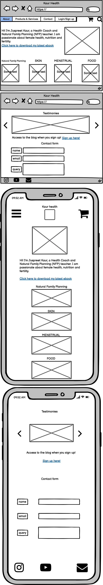
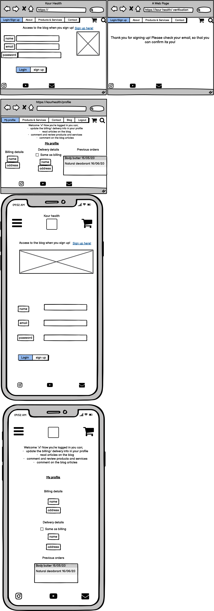
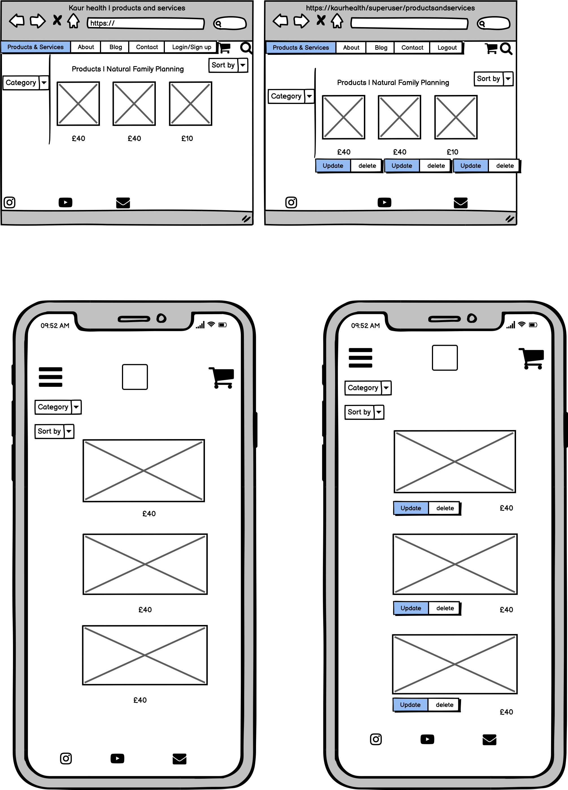
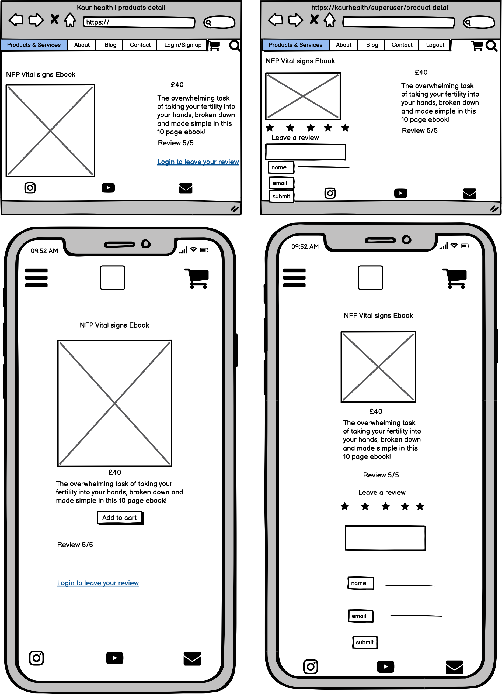
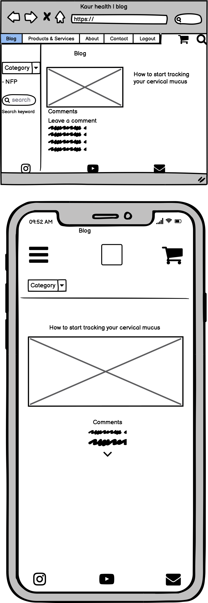
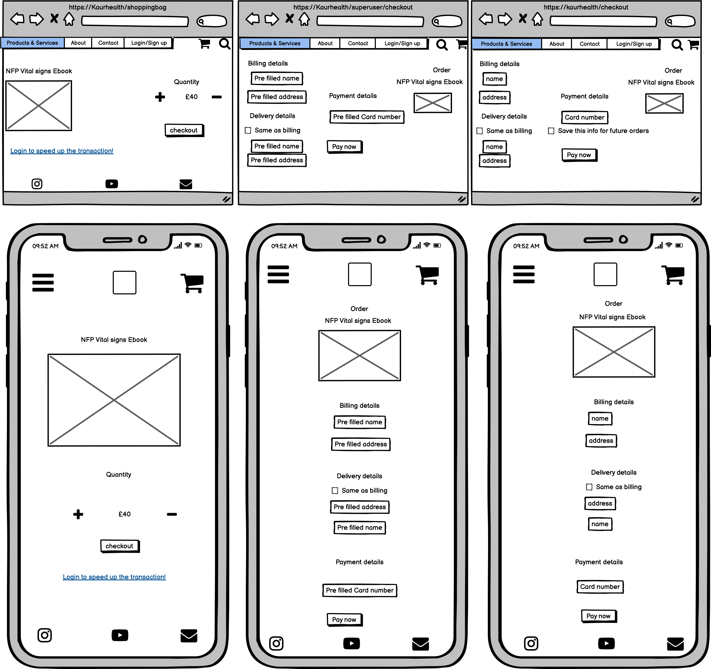

# Landing page

here i have satisfied the navigation section of the user stories;
-
-
-

# Login

here i have satisfied the navigation section of the user stories;
-
-
-

# Online shop

here i have satisfied the navigation section of the user stories;
-
-
-
# Product detail

here i have satisfied the navigation section of the user stories;
-
-
-
# Blog

here i have satisfied the navigation section of the user stories;
-
-
-

# Checkout

here i have satisfied the navigation section of the user stories;
-
-
-

